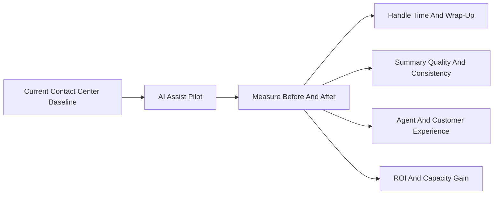

# AI Assist Benefits

This chapter explains how to position AI Assist in Webex Contact Center conversations. The goal is to make AI Assist feel like a natural part of every contact center opportunity, not a late-stage add-on.

AI Assist helps agents work faster, document interactions more consistently, and serve customers with better context. It also gives sellers and customer teams a practical way to quantify value through average handle time, after-call work, agent capacity, customer experience, and operational workflow improvements.

## What

AI Assist is a set of AI-powered capabilities that support live agents during and after customer interactions. It does not replace the contact center agent. It helps the agent perform the work with less friction.

In a Webex Contact Center motion, AI Assist can support:

| Capability | What It Helps With |
| --- | --- |
| Real-time transcription | Gives the agent and downstream workflow a live record of the conversation |
| Knowledge surfacing | Brings relevant answers or guidance into the agent experience |
| Suggested responses | Helps agents respond faster and more consistently |
| Auto wrap-up | Reduces repetitive after-call work |
| Post-call summaries | Creates cleaner notes for CRM, ServiceNow, quality, and analytics workflows |
| Real-time assist | Coaches the agent during the interaction instead of only after the fact |

AI Assist is most valuable when it is tied to a specific operational pain point: long handle time, inconsistent notes, slow agent ramp, agent burnout, customer churn, poor visibility into call reasons, or manual follow-up work.

## Why

Contact centers are measured through time, quality, and outcomes. AI Assist creates value because it improves the work while the agent is doing it and reduces the manual cleanup after the interaction is complete.

The common mistake is positioning AI Assist only as a time-saving tool. Time savings matter, but the broader value is stronger:

| Value Area | Why It Matters |
| --- | --- |
| Agent productivity | Agents spend less time searching, typing, summarizing, and wrapping up |
| Agent experience | Repetitive cognitive load goes down, which can help reduce burnout |
| Customer experience | Customers receive faster, more consistent answers |
| Workflow quality | Notes and summaries become more consistent and useful for downstream teams |
| Business visibility | Better structured outputs improve analytics, classification, and reporting |
| Customer retention | Better service moments can support customer lifetime value and churn reduction |

For customer conversations, the strongest message is simple: AI Assist gives agents more capacity and better context without forcing the business to hire more people.

## How

Use AI Assist positioning as a discovery-led conversation. Start with the customer's current operating model, then connect each AI Assist capability to a measurable improvement.

### Map The Current Agent Workflow

Before discussing the AI feature set, understand where time and quality issues appear.

| Discovery Area | Questions To Ask |
| --- | --- |
| Handle time | What is the average handle time by queue, call type, or business unit? |
| After-call work | How much time do agents spend writing notes or completing wrap-up tasks? |
| Knowledge access | How do agents find policy, product, or troubleshooting information today? |
| Summary quality | Are call notes consistent enough for supervisors, analysts, and downstream teams? |
| Agent ramp | How long does it take for new agents to become confident and productive? |
| Retention risk | Which call types have high churn, frustration, repeat contact, or escalation risk? |

This discovery creates the baseline. Without a baseline, the customer may understand the feature but struggle to believe the value.

### Connect Features To Outcomes

Do not present AI Assist as one generic AI bundle. Map each capability to an operational outcome.

| AI Assist Capability | Operational Outcome |
| --- | --- |
| Real-time transcription | Less manual listening and cleaner interaction history |
| Knowledge surfacing | Faster answers and fewer hold/search delays |
| Suggested responses | Better consistency across new and experienced agents |
| Auto wrap-up | Shorter after-call work and faster agent availability |
| Post-call summaries | Better CRM, ServiceNow, analytics, and quality-review inputs |
| Real-time assist | In-call coaching that helps agents handle complex moments |

### Prove Value With Before And After Metrics

The simplest proof is a before-and-after comparison.

Good pilot metrics include:

- Average handle time.
- After-call work time.
- First contact resolution.
- Transfer or escalation rate.
- Summary quality and completeness.
- Agent satisfaction or burnout signals.
- Customer satisfaction or repeat-contact rate.
- Downstream workflow quality for CRM, ServiceNow, quality, or analytics teams.

## Benefits

### Reduced Average Handle Time

AI Assist can reduce handle time by helping agents find answers faster, respond more consistently, and complete wrap-up faster.

For many customer conversations, the most understandable value metric is cost per productive agent minute. Once a customer knows the cost of an agent minute, every second saved per call becomes a measurable business outcome.

### Lower After-Call Work

Manual note-taking and wrap-up work can consume meaningful agent capacity. AI-generated summaries and auto wrap-up help reduce that burden.

The benefit is not only time savings. It also improves consistency. A cleaner summary helps supervisors, quality teams, analysts, and downstream business teams understand what happened in the call.

### Better Agent Experience

Agents often struggle with context switching: listening, searching, typing, following policy, and responding with empathy at the same time. AI Assist lowers that load.

This matters most for:

- New agents who need more guidance.
- Complex queues with many policies or procedures.
- High-volume environments where repetitive work creates burnout.
- Regulated workflows where consistent documentation matters.

### More Consistent Customer Experience

AI Assist can help every agent follow the same guidance, use the same approved information, and produce more consistent notes.

The customer experience benefit is not just speed. It is also trust. Customers are less likely to receive inconsistent answers, and business teams get better visibility into what customers are asking for.

### Better Business Analytics

When summaries and classifications are cleaner, the contact center can understand patterns more clearly.

Examples:

| Better Input | Business Use |
| --- | --- |
| Cleaner call summaries | Better quality review and supervisor coaching |
| More consistent issue classification | Better trend reporting and root-cause analysis |
| Reduced manual note variation | Better downstream CRM or ServiceNow data |
| Clearer call reasons | Better product, process, and staffing decisions |

## Attach Rate Strategy

AI Assist should be part of the initial Webex Contact Center motion. If it is treated as optional, customers may defer it because they are not ready, do not have budget, or do not yet understand the value.

Use the customer's readiness to decide the attach motion.

| Customer Situation | Recommended Motion |
| --- | --- |
| Ready and funded | Include AI Assist in the committed first-phase deal |
| Interested but not ready to deploy | Attach it enabled or uncommitted so it is available later |
| Budget constrained | Use consumption or overage as a lower-friction starting point |
| Unsure about value | Run a trial or pilot with before-and-after measurements |
| Contact center team is not asking for it | Bring in business stakeholders who care about churn, productivity, analytics, and customer experience |

The key message is: do not wait for the customer to ask for AI Assist. Lead with the value and provide a path that matches their readiness.

## ROI Cost Validation

The ROI story should start with the customer's own cost structure. Contact center leaders understand cost per contact, cost per minute, average handle time, after-call work, and staffing capacity.

### Baseline Agent Cost Model

Start with fully burdened agent cost:

- Wages.
- Benefits.
- Technology licenses.
- Facilities.
- Supervisor and support overhead where appropriate.

Then convert that to productive minutes.

| Model Item | Example Assumption |
| --- | --- |
| Productive occupancy | 80 percent |
| Productive minutes per agent per year | About 100,000 |
| Cost per productive minute | About $0.65 |
| Typical cost range | About $0.50 to $1.00 per productive minute |

The exact number should be adjusted for the customer's labor market, queue type, outsourcing model, and contact complexity.

### Simple ROI Example

Use a simple model that a business owner can understand.

| Input | Example |
| --- | --- |
| Agents | 100 |
| Calls per agent per day | 50 |
| Average handle time | About 7 minutes |
| AI Assist time saved | About 70 seconds per call |
| Cost per productive minute | About $0.65 |

That produces a practical capacity story:

| Result | Approximate Value |
| --- | --- |
| Time recovered per agent per day | About 58 minutes |
| Time recovered across 100 agents per day | About 97 hours |
| Capacity gained | About 11.5 full-time agents |
| Net annual ROI after AI usage cost | About $750K |

The customer-facing framing matters. Do not lead with headcount reduction. Lead with capacity gained.

> AI Assist can help the customer gain the capacity of additional agents without hiring, while also improving speed, consistency, agent experience, and customer experience.

## Sales Talk Track

Use this talk track when positioning AI Assist:

1. Start with the business problem.
2. Establish the current baseline for handle time, wrap-up, knowledge search, summary quality, and agent ramp.
3. Map AI Assist capabilities to the customer's measurable pain points.
4. Propose a trial, pilot, or committed attach motion based on readiness.
5. Validate ROI with before-and-after data.
6. Position the outcome as recovered capacity, not agent replacement.

Example:

> If we can save even 60 to 70 seconds per call, that becomes real capacity across the contact center. For a 100-agent operation, that can translate into dozens of recovered labor hours per day. The goal is not just lower cost. It is faster service, better summaries, better agent experience, and more capacity without hiring at the same pace.

## Implementation Checklist

- Identify the target queue or use case.
- Capture baseline AHT, after-call work, contact volume, and agent cost.
- Identify the most repetitive agent tasks.
- Confirm where summaries or classifications flow next.
- Enable the relevant AI Assist capabilities.
- Run a pilot with clear start and end dates.
- Measure before-and-after results.
- Convert time savings into recovered capacity and ROI.
- Review summary quality with supervisors and downstream teams.
- Decide whether to expand from pilot to committed deployment.

## Key Takeaway

AI Assist is not only an AI feature. It is a measurable productivity and quality layer for the contact center.

The strongest value story is:

- Save agent time during and after the interaction.
- Improve consistency of answers and summaries.
- Reduce repetitive agent effort.
- Give supervisors and business teams cleaner data.
- Increase contact center capacity without requiring proportional hiring.
- Attach AI early so the customer is ready when the business asks for AI outcomes.

## FAQ

### Q1. Is AI Assist only about reducing handle time?

No. Handle time is the easiest metric to quantify, but AI Assist also supports summary quality, agent experience, workflow consistency, business analytics, customer experience, and customer retention.

### Q2. Should AI Assist be positioned only after the contact center platform is sold?

No. AI Assist should be introduced early in the Webex Contact Center sales motion. If the customer is not ready to deploy, use an enabled, uncommitted, consumption, or trial path so the capability is attached and ready.

### Q3. How should ROI be calculated?

Start with the customer's fully burdened agent cost and convert it into cost per productive minute. Then estimate time saved per call, multiply by call volume, and subtract the AI usage cost. Validate the model with pilot data whenever possible.

### Q4. How should sellers avoid making the ROI story sound like layoffs?

Frame the value as recovered capacity. The customer gains the equivalent capacity of additional agents without hiring at the same pace. That capacity can be used to absorb volume, improve service levels, reduce burnout, or shift agents to higher-value work.

### Q5. Which customers are good candidates for AI Assist?

Good candidates have high call volume, long handle time, heavy after-call work, complex knowledge needs, inconsistent notes, high agent ramp time, or downstream workflows that depend on clean interaction summaries.

### Q6. What if the customer says they are not ready for AI?

Do not force a full deployment conversation. Offer a lighter path: attach it uncommitted, start with consumption, run a pilot, or focus on a low-risk queue such as help desk. The goal is to make AI Assist available when the customer is ready.

### Q7. What makes a strong AI Assist pilot?

A strong pilot has a clear queue, a baseline, a measurable target, a before-and-after report, supervisor review of summary quality, and a business owner who cares about the result.
