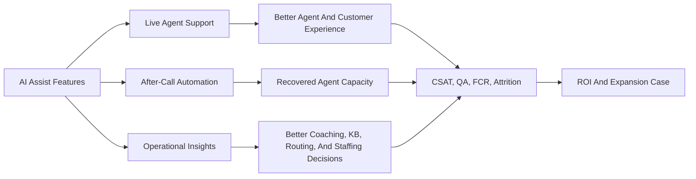
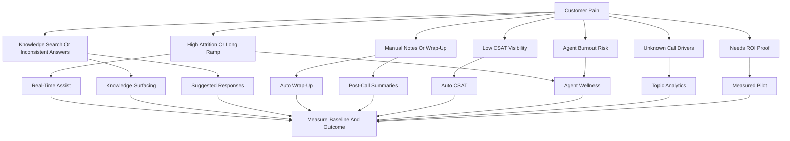
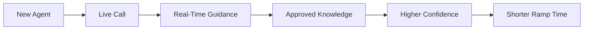
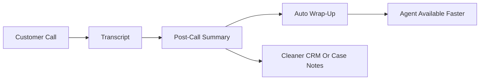
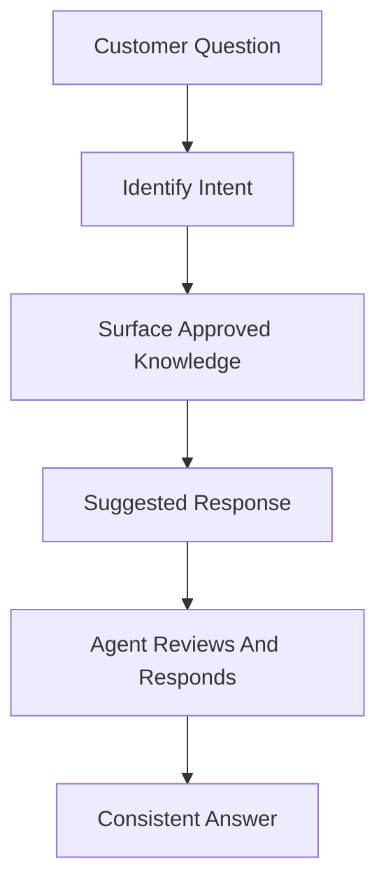
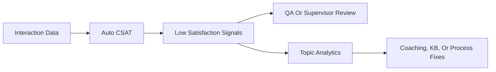
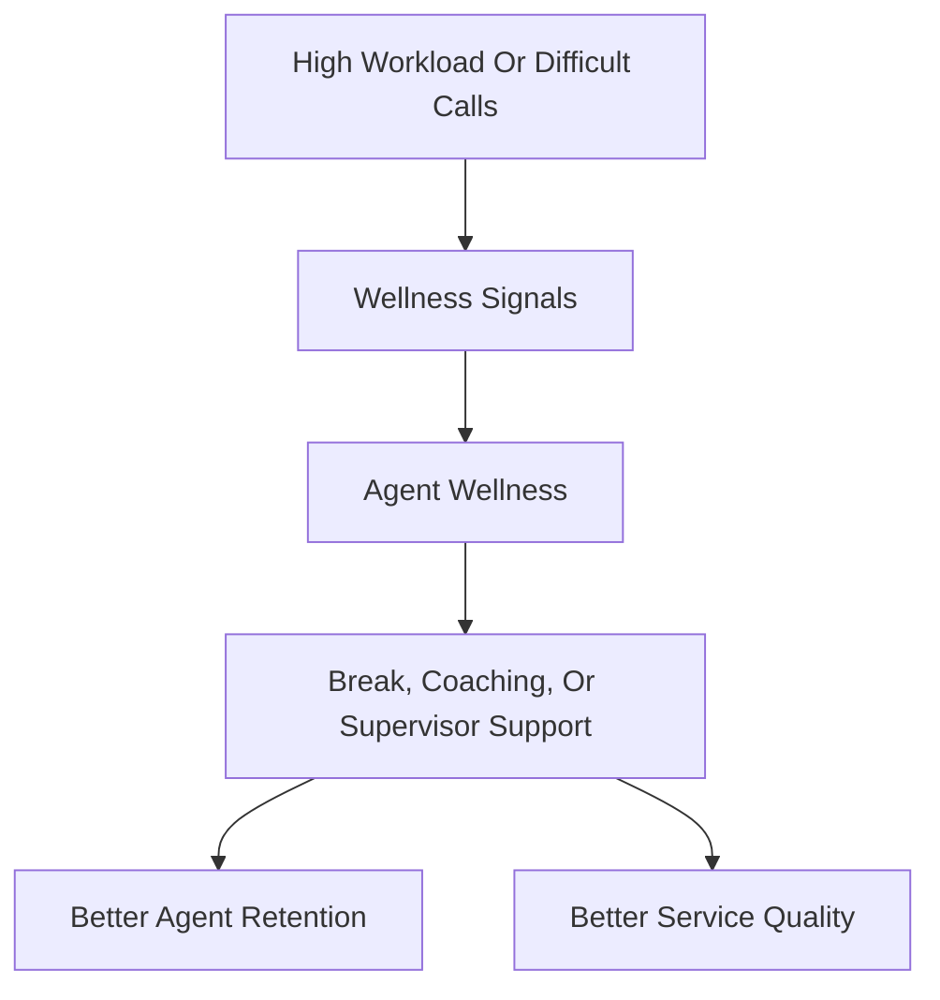
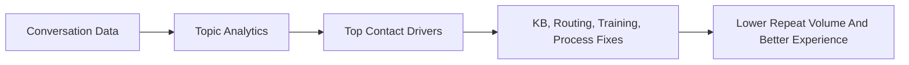
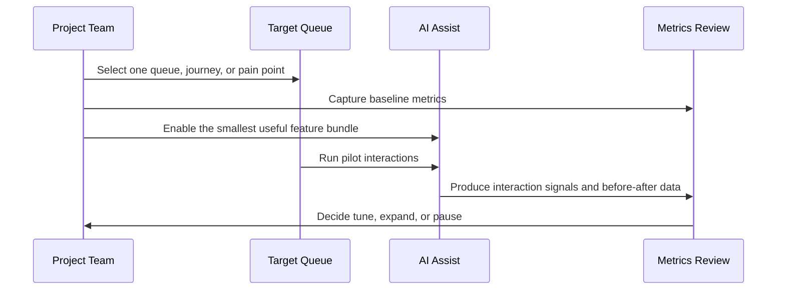
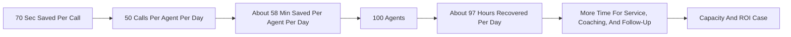

# AI Assist Benefits

This chapter is a fast-read guide for explaining AI Assist in Webex Contact Center conversations. It connects AI Assist features to practical customer scenarios, measurable business outcomes, and ROI validation.

AI Assist is a productivity, quality, insight, and agent-experience layer. It helps agents work faster, answer more consistently, reduce after-call work, improve visibility into customer interactions, and identify where the contact center should improve.

## Executive Summary

| Message | Why It Matters |
| --- | --- |
| AI Assist helps agents, it does not replace them | The strongest story is recovered capacity, better service quality, and better agent experience |
| Every feature should map to a use case | Scenario-first selling makes value easier to understand and defend |
| ROI starts with operational metrics | AHT, ACW, FCR, QA, CSAT, occupancy, attrition, and repeat contact create the baseline |
| Pilot with before-and-after data | A focused pilot turns AI value from opinion into measurable proof |

## Capability And Use-Case Map

| AI Assist Feature | What It Does | Primary Use Cases | Core Metrics |
| --- | --- | --- | --- |
| Real-time assist | Guides agents during live conversations | New-agent ramp, complex calls, retention conversations | Ramp time, AHT, QA, FCR |
| Knowledge surfacing | Brings approved answers into the agent experience | Policy-heavy support, troubleshooting, cross-trained queues | Search time, hold time, answer accuracy |
| Suggested responses | Recommends consistent response language | Consistent answers, faster digital replies, sensitive topics | QA, CSAT, repeat contact |
| Real-time transcription | Captures live conversation context | Coaching, escalation, compliance review, summary generation | Review time, escalation quality, compliance review time |
| Auto wrap-up | Reduces manual wrap-up effort | High ACW, disposition quality, repetitive admin work | ACW, occupancy, service level |
| Post-call summaries | Creates cleaner interaction notes | CRM/case notes, QA review, downstream analytics | Case completeness, rework, summary quality |
| Auto CSAT | Estimates customer satisfaction signals from interactions | Low survey response, targeted QA, unhappy-customer detection | CSAT coverage, low-score trends, complaint rate |
| Agent Wellness | Identifies agent stress or burnout signals | Burnout risk, attrition reduction, supervisor intervention | Attrition, absenteeism, agent satisfaction |
| Topic Analytics | Finds recurring topics and interaction drivers | Root-cause analysis, KB improvement, routing and staffing decisions | Top topics, repeat drivers, transfer rate |

## Value Chain



## Scenario Picker



## Scenario Cards

### 1. High Agent Attrition And Long Training Time

| Field | Guidance |
| --- | --- |
| Problem | New agents take too long to become productive and supervisors spend too much time helping during live calls |
| Best-fit features | Real-time assist, knowledge surfacing, suggested responses, agent wellness |
| Use case | Help new agents during live interactions with contextual guidance and approved answers |
| Business value | Shorter ramp time, fewer supervisor assists, better consistency, lower agent frustration |
| Measures | Training time, new-agent AHT, QA score, supervisor assists, early-tenure attrition |



### 2. Heavy After-Call Work

| Field | Guidance |
| --- | --- |
| Problem | Agents spend too much time typing notes, selecting dispositions, and completing wrap-up tasks |
| Best-fit features | Auto wrap-up, post-call summaries, real-time transcription |
| Use case | Reduce manual work after the interaction and improve case-note quality |
| Business value | Faster agent availability, cleaner records, less rework for downstream teams |
| Measures | ACW, occupancy, calls handled per agent, note completeness, rework |



### 3. Complex Knowledge And Inconsistent Answers

| Field | Guidance |
| --- | --- |
| Problem | Agents search across multiple sources and response quality varies by agent |
| Best-fit features | Knowledge surfacing, suggested responses, real-time assist |
| Use case | Bring approved knowledge and response guidance into the agent workflow |
| Business value | Faster answers, fewer holds, better consistency, fewer escalations |
| Measures | Hold time, search time, answer accuracy, repeat contacts, escalation rate |



### 4. Low CSAT Visibility

| Field | Guidance |
| --- | --- |
| Problem | Only a small percentage of customers respond to surveys, so leaders lack a full view of customer satisfaction |
| Best-fit features | Auto CSAT, post-call summaries, topic analytics |
| Use case | Use interaction signals to estimate satisfaction trends and prioritize follow-up, coaching, and process fixes |
| Business value | Better CX coverage, faster detection of dissatisfied customers, more targeted quality review |
| Measures | CSAT coverage, low-score detection, complaint rate, repeat contact, QA sampling efficiency |



### 5. Agent Burnout Or Wellness Risk

| Field | Guidance |
| --- | --- |
| Problem | Agents handle repeated difficult conversations and leaders do not see stress signals early enough |
| Best-fit features | Agent Wellness, real-time assist, auto wrap-up |
| Use case | Identify wellness risk signals and reduce repetitive work that contributes to burnout |
| Business value | Better agent support, lower attrition risk, improved morale, more sustainable performance |
| Measures | Attrition, absenteeism, adherence, agent satisfaction, wellness alerts, ACW |



### 6. Unknown Contact Drivers

| Field | Guidance |
| --- | --- |
| Problem | Leaders know call volume is high, but do not clearly know which topics are driving demand |
| Best-fit features | Topic Analytics, post-call summaries, real-time transcription |
| Use case | Identify recurring topics, emerging issues, and deflection or automation candidates |
| Business value | Better staffing, better knowledge content, better routing, better process improvement |
| Measures | Top topics, emerging trends, repeat contacts, deflection candidates, queue transfer rate |



## Feature Bundle Patterns

| Customer Motion | Recommended Bundle | Why This Works |
| --- | --- | --- |
| Agent productivity | Real-time assist, knowledge surfacing, suggested responses | Helps agents answer faster during the interaction |
| After-call automation | Real-time transcription, post-call summaries, auto wrap-up | Reduces manual work after the call and improves note quality |
| Customer experience visibility | Auto CSAT, topic analytics, post-call summaries | Finds satisfaction patterns and the topics behind them |
| Agent experience | Agent wellness, real-time assist, auto wrap-up | Supports agents while reducing repetitive work |
| Operational intelligence | Topic analytics, transcription, summaries, auto CSAT | Converts interactions into signals leaders can act on |

## Metric Map

| Metric | Features That Influence It | How To Validate |
| --- | --- | --- |
| Average handle time | Real-time assist, knowledge surfacing, suggested responses | Compare AHT before and after pilot by queue |
| After-call work | Auto wrap-up, post-call summaries, transcription | Measure ACW by queue and agent group |
| First contact resolution | Knowledge surfacing, suggested responses, real-time assist | Compare repeat contacts and escalations |
| Agent ramp time | Real-time assist, knowledge surfacing, suggested responses | Track new-agent productivity curve |
| QA score | Suggested responses, transcription, summaries, Auto CSAT | Review supervisor scorecards and sample interactions |
| CSAT visibility | Auto CSAT, topic analytics, summaries | Compare survey-only coverage vs AI-assisted coverage |
| Agent attrition risk | Agent wellness, auto wrap-up, real-time assist | Track attrition, absenteeism, burnout indicators, and agent surveys |
| Business visibility | Topic analytics, transcription, summaries, wrap-up | Review reporting completeness and topic trend usefulness |
| Cost per contact | Real-time assist, knowledge surfacing, auto wrap-up | Compare time saved and cost per contact before and after pilot |

## Pilot Design



| Pilot Step | What To Do | Output |
| --- | --- | --- |
| Pick the use case | Choose one queue, call type, or business outcome | Clear pilot scope |
| Capture baseline | Measure AHT, ACW, volume, QA, FCR, CSAT, attrition, and cost where relevant | Before view |
| Select features | Choose the smallest feature bundle tied to the pain | Controlled pilot |
| Validate quality | Review summaries, suggestions, Auto CSAT patterns, wellness signals, and topics | Trust validation |
| Compare results | Measure before-and-after changes | ROI evidence |
| Decide next step | Tune, expand, or pause based on data | Expansion plan |

## ROI And Cost Validation

Start with a model the customer already understands: agent minutes, call volume, cost per productive minute, and measurable improvement.

| Input | Example |
| --- | --- |
| Agents | 100 |
| Calls per agent per day | 50 |
| Average handle time | About 7 minutes |
| AI Assist time saved | About 70 seconds per call |
| Cost per productive minute | About $0.65 |



| ROI Lever | How To Prove It | Example Business Case |
| --- | --- | --- |
| Time saved during the call | Measure AHT reduction | More available time to absorb volume, shorten waits, and improve service levels |
| Time saved after the call | Measure ACW reduction | Faster agent availability and lower cost per contact |
| Better first contact resolution | Measure repeat contacts and escalations | Lower avoidable volume |
| Better satisfaction visibility | Compare survey coverage to Auto CSAT coverage | Faster detection of poor experiences |
| Lower agent attrition risk | Track wellness signals, surveys, absenteeism, and attrition | More stable teams and lower onboarding pressure |
| Better topic visibility | Track top drivers and fixes over time | Better routing, KB, staffing, and automation decisions |

Simple capacity formula:

```text
Recovered hours per day =
(seconds saved per interaction * interactions per day) / 3600

Capacity value =
recovered hours * productive agent cost per hour

Net ROI =
capacity value + measurable quality gains - AI usage cost
```

Customer-facing framing:

| Message | Meaning |
| --- | --- |
| Recovered capacity | Agents have more time available for service, follow-up, coaching, and higher-value work |
| Better quality | Answers, summaries, and wrap-up data become more consistent |
| Better visibility | Leaders see customer satisfaction signals, agent wellness signals, and recurring topics earlier |
| Measurable proof | The business case comes from before-and-after pilot data, not assumptions |

## Fast Qualification Questions

| Question | What It Reveals |
| --- | --- |
| What is your average handle time by queue? | Time-saving opportunity |
| How much after-call work do agents perform? | Wrap-up and summary opportunity |
| How do agents find answers today? | Knowledge surfacing opportunity |
| How long does new-agent training take? | Real-time assist opportunity |
| Are summaries or dispositions consistent? | Summary and wrap-up quality opportunity |
| How much of your customer feedback comes from surveys? | Auto CSAT opportunity |
| Which queues show the highest agent stress or attrition? | Agent Wellness opportunity |
| Do you know the top reasons customers contact you? | Topic Analytics opportunity |
| Which calls create the most repeat contacts or escalations? | FCR and customer experience opportunity |
| Who consumes the notes after the call? | Downstream workflow and analytics opportunity |

## Implementation Checklist

| Phase | Checklist |
| --- | --- |
| Discover | Pick the pain point, queue, business owner, and target outcome |
| Baseline | Capture AHT, ACW, QA, FCR, CSAT, volume, attrition, and agent cost where relevant |
| Design | Choose the smallest feature bundle that maps to the pain |
| Pilot | Run a focused pilot with clear start and end dates |
| Review | Validate quality of suggestions, summaries, Auto CSAT, wellness signals, and topic outputs |
| Measure | Compare before-and-after results and convert time savings into recovered capacity |
| Expand | Scale to more queues only after value is proven |

## Key Takeaway

AI Assist is easiest to sell when each feature is tied to a customer scenario and a measurable metric. The headline message:

> AI Assist gives the contact center recovered capacity, better agent experience, cleaner operational data, and clearer customer insights. Start with one measurable use case, prove value, then expand.

## FAQ

### Q1. Is AI Assist only about reducing handle time?

No. Handle time is one metric. AI Assist also improves after-call work, agent ramp, answer consistency, summary quality, CSAT visibility, agent wellness, and business insight.

### Q2. Which feature should come first?

Start with the customer's pain point. If the pain is training, lead with real-time assist. If the pain is manual notes, lead with auto wrap-up and summaries. If the pain is low satisfaction visibility, lead with Auto CSAT. If the pain is unknown call drivers, lead with Topic Analytics.

### Q3. How should ROI be calculated?

Use the customer's fully burdened agent cost, convert it to cost per productive minute, estimate time saved per interaction, multiply by contact volume, and subtract AI usage cost. Then add measurable quality gains such as repeat-contact reduction, better CSAT visibility, or lower attrition risk only when the customer can validate the data.

### Q4. How do we explain this to executives?

Explain it as recovered capacity, better service quality, better agent experience, and better business visibility. Tie the ROI to measurable operational improvement instead of staffing reduction.

### Q5. What makes a good pilot?

A good pilot has one target queue, clear baseline metrics, a small feature bundle, before-and-after reporting, quality review, and an expansion decision.
