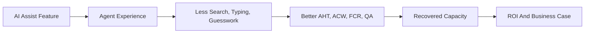
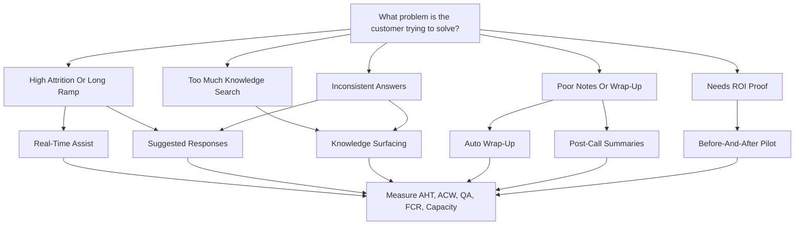
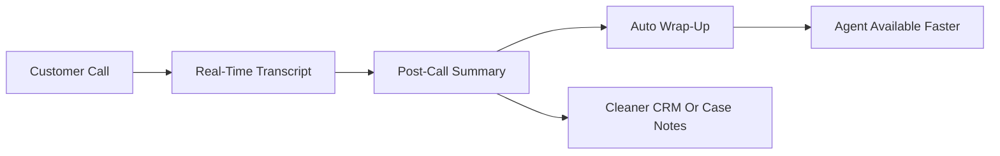
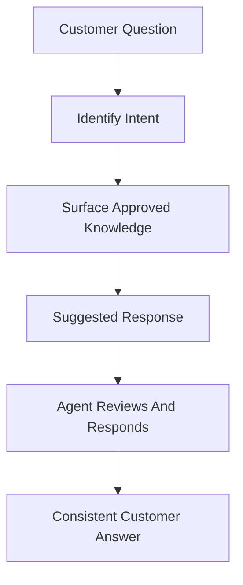
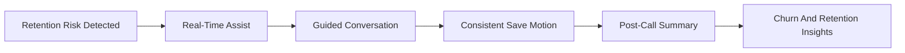
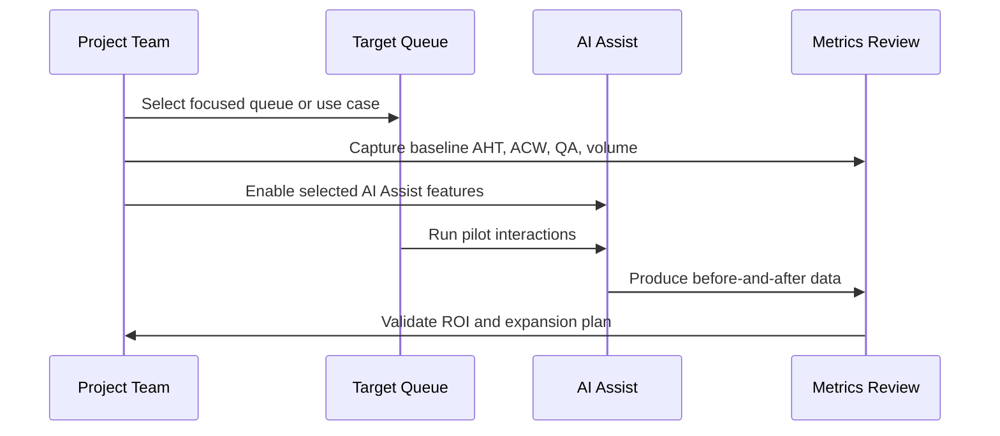
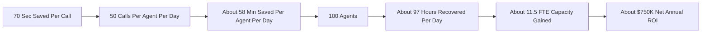
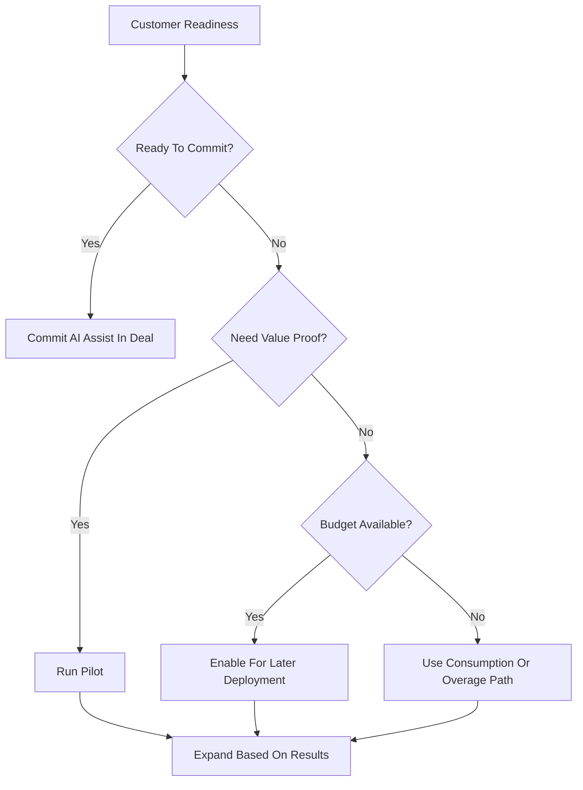

# AI Assist Benefits

This chapter is a fast-read guide for positioning AI Assist in Webex Contact Center conversations. It connects each AI Assist feature to practical contact center scenarios, measurable business outcomes, and a simple ROI story.

AI Assist should be positioned as an agent productivity, quality, and capacity layer. It helps agents work faster, answer more consistently, reduce after-call work, and create better operational data for supervisors and business teams.

## Executive Summary

| Message | Why It Matters |
| --- | --- |
| AI Assist helps agents, it does not replace them | The strongest story is recovered capacity and better experience, not headcount reduction |
| Every feature should map to a use case | Feature-first selling makes value feel abstract; scenario-first selling makes it real |
| ROI starts with agent minutes | Contact center leaders understand cost per minute, AHT, ACW, occupancy, and staffing capacity |
| Attach early | AI Assist should be part of the first Webex Contact Center motion, even if deployment starts later |
| Pilot with before-and-after data | A focused pilot turns AI value from opinion into measurable proof |

## What AI Assist Does

| AI Assist Feature | Plain-English Purpose | Primary Value |
| --- | --- | --- |
| Real-time assist | Guides agents during live conversations | Faster ramp, better coaching, more consistent handling |
| Knowledge surfacing | Brings approved answers into the agent experience | Less search time, fewer holds, better answer accuracy |
| Suggested responses | Recommends consistent response language | Faster replies, better quality, more consistent tone |
| Real-time transcription | Captures live conversation context | Better visibility, coaching, escalation, and review |
| Auto wrap-up | Reduces manual wrap-up effort | Lower after-call work and faster agent availability |
| Post-call summaries | Creates cleaner interaction notes | Better CRM, case, quality, and analytics data |

## Value Chain

## Feature-To-Scenario Matrix

Use this table to quickly map customer pain to the right AI Assist feature.

| Customer Pain | Best-Fit Feature | Use Case | Success Metrics |
| --- | --- | --- | --- |
| High agent attrition and frequent hiring | Real-time assist | Reduce new-agent ramp time with in-call guidance | Training time, new-agent AHT, QA score, supervisor assists |
| Agents spend too much time searching for answers | Knowledge surfacing | Surface approved knowledge during the call | Hold time, search time, answer accuracy, escalation rate |
| Different agents give different answers | Suggested responses | Standardize responses for common intents and policies | QA score, repeat contact rate, response consistency, CSAT |
| Supervisors lack visibility into call context | Real-time transcription | Capture live conversation context for review and coaching | Review time, coaching quality, escalation context, compliance review |
| Agents spend too long after the call | Auto wrap-up | Reduce disposition and wrap-up effort | ACW, occupancy, calls handled per agent, wrap-up completion |
| Case notes are inconsistent or incomplete | Post-call summaries | Generate cleaner notes for downstream systems | Summary quality, rework rate, analyst satisfaction, case completeness |
| Business wants AI but doubts value | Pilot and ROI measurement | Run before-and-after proof on one queue | AHT delta, ACW delta, usage cost, recovered capacity |

## Scenario Picker

## Scenario Cards

### 1. High Agent Attrition And Long Training Time

| Field | Guidance |
| --- | --- |
| Problem | New agents take too long to become productive and supervisors spend too much time coaching live calls |
| Best-fit features | Real-time assist, knowledge surfacing, suggested responses, real-time transcription |
| Use case | Help new agents during live interactions with contextual guidance and next-best actions |
| Business value | Shorter ramp time, fewer supervisor assists, more consistent service |
| Measures | Training time, new-agent AHT, QA score, supervisor assists, attrition rate |

### 2. Heavy After-Call Work

| Field | Guidance |
| --- | --- |
| Problem | Agents spend too much time typing notes, selecting dispositions, and completing wrap-up tasks |
| Best-fit features | Auto wrap-up, post-call summaries, real-time transcription |
| Use case | Reduce manual wrap-up and return agents to availability faster |
| Business value | More productive agent time and better notes |
| Measures | ACW, occupancy, calls handled per agent, note completeness, rework |

### 3. Complex Knowledge And Inconsistent Answers

| Field | Guidance |
| --- | --- |
| Problem | Agents search too many places for answers and response quality varies by agent |
| Best-fit features | Knowledge surfacing, suggested responses, real-time assist |
| Use case | Bring approved content and suggested response guidance into the agent workflow |
| Business value | Faster answers, fewer holds, better consistency |
| Measures | Hold time, search time, answer accuracy, repeat contacts, escalation rate |

### 4. Customer Retention Or High-Value Conversations

| Field | Guidance |
| --- | --- |
| Problem | The customer wants better outcomes for sensitive, high-value, or retention-risk interactions |
| Best-fit features | Real-time assist, suggested responses, knowledge surfacing, post-call summaries |
| Use case | Guide agents through retention, escalation, or complex service recovery conversations |
| Business value | Better save motions, better consistency, better visibility into churn reasons |
| Measures | Retention rate, save rate, FCR, CSAT, escalation rate, repeat contact rate |

## Feature Playbooks

### Real-Time Assist

| Use Case | Trigger | Outcome | Metrics |
| --- | --- | --- | --- |
| New-agent ramp | New agents need live guidance | Agents get contextual help while serving customers | Ramp time, new-agent AHT, QA |
| Complex policy handling | Agents must follow many rules | Agents receive next-best guidance | Error rate, escalation rate, compliance review |
| Retention conversation | Customer is frustrated or at risk | Agent receives guidance for save motion | Save rate, CSAT, repeat contact |
| Supervisor scale | Supervisors cannot coach every call | AI gives consistent in-call guidance | Supervisor assists, QA score |

### Knowledge Surfacing

| Use Case | Trigger | Outcome | Metrics |
| --- | --- | --- | --- |
| Policy-heavy support | Agents search multiple sources | Approved answers appear in workflow | Search time, hold time |
| Troubleshooting | Agents need step-by-step guidance | Faster issue resolution | FCR, AHT, escalation rate |
| Cross-trained agents | Agents cover multiple queues | Agents get relevant knowledge by intent | Accuracy, QA, transfer rate |
| Content governance | Business wants approved answers | Agents use controlled knowledge | QA score, compliance findings |

### Suggested Responses

| Use Case | Trigger | Outcome | Metrics |
| --- | --- | --- | --- |
| Response consistency | Agents phrase answers differently | More consistent customer messaging | QA, CSAT, repeat contact |
| Faster digital replies | Chat or messaging queues need speed | Agents respond faster with reviewable suggestions | Response time, backlog |
| Sensitive topics | Agents need careful wording | Suggested language reduces risk | Escalations, compliance review |
| New-product support | Agents are learning new offerings | Suggested responses reduce guesswork | Training time, QA |

### Real-Time Transcription

| Use Case | Trigger | Outcome | Metrics |
| --- | --- | --- | --- |
| Live coaching | Supervisor needs interaction context | Conversation is visible for review | Coaching time, QA |
| Escalation context | Call moves to another team | Next owner has a clearer history | Repeat questions, transfer success |
| Compliance review | Regulated conversations need review | Interaction record supports audit | Review time, findings |
| Summary generation | Notes need accurate source context | Better summaries and wrap-up | Summary quality, rework |

### Auto Wrap-Up

| Use Case | Trigger | Outcome | Metrics |
| --- | --- | --- | --- |
| High ACW | Agents spend too long after calls | Wrap-up time decreases | ACW, occupancy |
| Disposition quality | Wrap codes are inconsistent | More complete wrap-up data | Disposition accuracy |
| High-volume queues | Small delays add up quickly | More agent capacity recovered | Calls handled, service level |
| Repetitive workflows | Agents repeat the same admin tasks | Less manual effort | Agent satisfaction, ACW |

### Post-Call Summaries

| Use Case | Trigger | Outcome | Metrics |
| --- | --- | --- | --- |
| Inconsistent case notes | Notes vary by agent | Summaries become cleaner and more consistent | Summary quality, rework |
| Downstream analytics | Business wants better call reasons | Better source data for reporting | Classification quality |
| Supervisor review | Supervisors need faster review | Easier call review and coaching | Review time, QA |
| Follow-up workflows | Teams need accurate context | Better handoff to CRM/case systems | Case completeness |

## Feature-To-Metric Map

| Metric | Features That Influence It | How To Validate |
| --- | --- | --- |
| Average handle time | Real-time assist, knowledge surfacing, suggested responses | Compare AHT before and after pilot |
| After-call work | Auto wrap-up, post-call summaries, transcription | Measure ACW by queue and agent group |
| First contact resolution | Knowledge surfacing, suggested responses, real-time assist | Compare repeat contacts and escalations |
| Agent ramp time | Real-time assist, knowledge surfacing, suggested responses | Track new-agent productivity curve |
| QA score | Suggested responses, transcription, summaries | Supervisor scorecards and review samples |
| Agent experience | Real-time assist, auto wrap-up, knowledge surfacing | Agent surveys and burnout indicators |
| Business visibility | Transcription, summaries, wrap-up | Reporting completeness and classification quality |

## Pilot Design

| Pilot Step | What To Do | Output |
| --- | --- | --- |
| Pick a narrow use case | Choose one queue, journey, or call type | Clear pilot scope |
| Capture baseline | Measure AHT, ACW, volume, QA, escalations | Before view |
| Enable features | Turn on the smallest feature set needed | Controlled pilot |
| Review quality | Check summaries, suggestions, and knowledge matches | Trust validation |
| Compare results | Measure before-and-after changes | ROI evidence |
| Decide expansion | Expand, tune, or pause based on data | Deployment plan |

## ROI Model

Start with a simple model a contact center leader already understands.

| Input | Example |
| --- | --- |
| Agents | 100 |
| Calls per agent per day | 50 |
| Average handle time | About 7 minutes |
| AI Assist time saved | About 70 seconds per call |
| Cost per productive minute | About $0.65 |

| Result | Approximate Value |
| --- | --- |
| Time recovered per agent per day | About 58 minutes |
| Time recovered across 100 agents per day | About 97 hours |
| Capacity gained | About 11.5 full-time agents |
| Net annual ROI after AI usage cost | About $750K |

Customer-facing framing:

| Say This | Avoid Leading With |
| --- | --- |
| "This gives you recovered capacity." | "This lets you reduce headcount." |
| "Agents can handle more work with less friction." | "AI replaces the agent." |
| "We can validate this with before-and-after data." | "Trust the AI business case." |
| "Start with one queue and prove it." | "Turn everything on at once." |

## Attach Motion

| Customer Readiness | Recommended Motion | Why |
| --- | --- | --- |
| Ready and funded | Include AI Assist in the committed first-phase deal | Captures value early |
| Interested but not ready | Attach enabled or uncommitted | Keeps AI available when the business is ready |
| Budget constrained | Start with consumption or overage | Reduces entry friction |
| Unsure about value | Run a measured pilot | Converts doubt into proof |
| Contact center team is passive | Bring business stakeholders into discovery | Business teams often own churn, analytics, and customer experience goals |

## Fast Qualification Questions

| Question | What It Reveals |
| --- | --- |
| What is your average handle time by queue? | Time-saving opportunity |
| How much after-call work do agents perform? | Wrap-up and summary opportunity |
| How do agents find answers today? | Knowledge surfacing opportunity |
| How long does new-agent training take? | Real-time assist opportunity |
| Are summaries or dispositions consistent? | Summary and wrap-up quality opportunity |
| Which calls create the most repeat contacts? | FCR and customer experience opportunity |
| Which queues have the highest attrition? | Agent experience and training opportunity |
| Who consumes the notes after the call? | Downstream workflow and analytics opportunity |

## Implementation Checklist

| Phase | Checklist |
| --- | --- |
| Discover | Pick the pain point, queue, and business owner |
| Baseline | Capture AHT, ACW, QA, FCR, volume, and agent cost |
| Design | Choose the smallest feature set that maps to the pain |
| Pilot | Run a focused pilot with clear start and end dates |
| Validate | Compare before-and-after results and review quality |
| Expand | Scale to more queues only after value is proven |

## Key Takeaway

AI Assist is easiest to sell when each feature is tied to a scenario and a metric.

| Feature | Fastest Value Story |
| --- | --- |
| Real-time assist | Reduce ramp time and guide agents during complex calls |
| Knowledge surfacing | Reduce search time and improve answer accuracy |
| Suggested responses | Improve consistency and response speed |
| Real-time transcription | Improve visibility, review, and context |
| Auto wrap-up | Reduce after-call work |
| Post-call summaries | Improve notes, analytics, and downstream workflows |

The headline message:

> AI Assist gives the contact center recovered capacity, better agent experience, and cleaner operational data. Start with one measurable use case, prove value, then expand.

## FAQ

### Q1. Is AI Assist only about reducing handle time?

No. Handle time is one metric. AI Assist also improves after-call work, agent ramp, answer consistency, summary quality, agent experience, and business visibility.

### Q2. Which feature should be positioned first?

Start with the customer's pain point. If the pain is training, lead with real-time assist. If the pain is knowledge search, lead with knowledge surfacing. If the pain is manual notes, lead with auto wrap-up and summaries.

### Q3. How should ROI be calculated?

Use the customer's fully burdened agent cost, convert it to cost per productive minute, estimate seconds saved per call, multiply by call volume, and subtract AI usage cost.

### Q4. How should this be framed to executives?

Frame it as recovered capacity and better service quality. Avoid making headcount reduction the primary message.

### Q5. What makes a good pilot?

A good pilot has one target queue, clear baseline metrics, a small feature set, before-and-after reporting, quality review, and an expansion decision.
