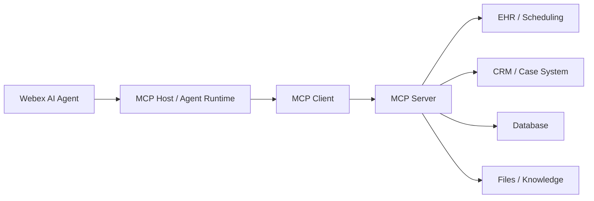
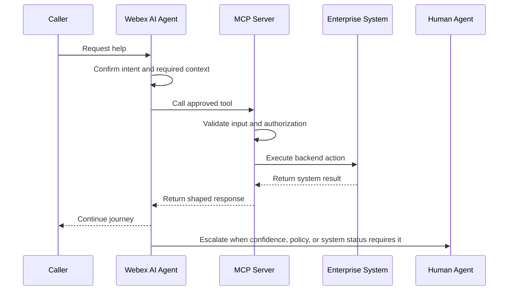

# Model Context Protocol

MCP stands for Model Context Protocol. In a Webex AI Agent architecture, MCP is the structured access layer that lets agents use approved tools, data, and enterprise systems without hardcoding every backend detail into the agent prompt.

> Image note: The images in this chapter were extracted as standalone picture objects from `MGB (1).pptx`. They are not full-slide screenshots.

## What

MCP is a standard way for an AI application or agent to access external tools, resources, and contextual data.

In contact center terms, the AI agent should not need to understand every backend API. It should ask an MCP server for an approved capability, such as appointment lookup, patient validation, billing status, case creation, or queue availability. The MCP server translates that structured request into the system-specific action and returns a result the agent can use.

### Core Components

| Component | Role |
| --- | --- |
| MCP Host | The AI agent environment that initiates tool and context access |
| MCP Client | The client-side connection configured through the Webex environment |
| MCP Server | The external server that exposes tools, resources, prompts, and system access |
| External systems | Databases, files, APIs, code repositories, CRM, EHR, ticketing, or other business systems |

The important idea is separation of responsibility. The AI agent invokes the capability. The MCP server handles the backend translation, policy controls, system access, and response shaping.

### Where MCP Fits

Use MCP when the target is a tool, data source, API, database, file store, knowledge source, or enterprise system.

Use A2A when the target is another agent.

| Need | Best Fit |
| --- | --- |
| Look up appointments in an EHR or scheduling system | MCP |
| Create or update a case in CRM | MCP |
| Check queue availability before handoff | MCP |
| Retrieve approved knowledge from controlled sources | MCP |
| Ask a billing agent to review billing intent | A2A |
| Transfer a caller to a scheduling agent | A2A |

## Why

MCP matters because prompt-heavy integrations become fragile as workflows grow. If every backend rule, schema, payload, and exception path lives in the agent instructions, the agent becomes harder to maintain and easier to break.

MCP moves tool definitions and system access patterns into a structured protocol layer.

| Prompt-Heavy Integration | MCP-Based Integration |
| --- | --- |
| Tool behavior is described in agent instructions | Tools are declared by the MCP server |
| Repetitive schemas consume context | Metadata is discovered at runtime |
| Small wording changes can break behavior | Tool contracts are more explicit |
| Each agent may need duplicated integration logic | One MCP capability can be reused |
| Backend payloads may become too large | Tool output can be shaped for the next step |

### Why It Helps The Business

MCP gives the customer a cleaner way to expose enterprise capabilities to AI agents:

- It reduces prompt complexity by moving system details out of the agent instructions.
- It supports reuse because one MCP capability can serve multiple agents or workflows.
- It improves governance because tools have explicit contracts and owners.
- It reduces risk because access can be scoped per tool and per workflow.
- It improves resilience because backend failures can be isolated to a specific capability.
- It makes future migration easier because one MCP server or tool can be replaced without redesigning the whole journey.

### Why Not One Giant MCP Server

A single large MCP server may look simple at first, but it can become a new monolith. Use the same modularity principle from the multi-agent strategy: split MCP servers when the domains have different risk, ownership, uptime, or lifecycle needs.

| MCP Boundary | Why Split It |
| --- | --- |
| Scheduling MCP | Different uptime, payload, and validation requirements |
| Billing MCP | Sensitive data and stronger approval controls |
| Insurance MCP | Coverage exceptions may need human review |
| CRM or case MCP | Different system owner and lifecycle |
| Knowledge MCP | Read-only access and lower operational risk |

This makes the architecture easier to operate. If a vendor later releases a stronger production-ready MCP server, the customer can migrate one function without rebuilding the whole AI journey.

### Why Security Matters

If a customer builds or hosts their own MCP server, they own the operational guardrails. MCP should be treated as a production integration surface, not as a lightweight prompt helper.

Key risk areas:

- Over-permissioned tools.
- Sensitive data exposure.
- Prompt-injection attacks against tool outputs or retrieved content.
- Unvalidated inputs passed into backend systems.
- Large responses that leak unnecessary data.
- Missing audit trails for tool calls.
- No fallback path when the MCP server or backend system fails.

## How

Design MCP around small, governed capabilities that match the customer journey. Start with the action the agent needs, define the input and output contract, apply least privilege, and return only the data needed for the next step.

### Recommended Design Pattern

### Design Each MCP Tool

For every MCP capability, define:

| Design Item | Guidance |
| --- | --- |
| Tool purpose | One clear business action, such as `lookupAppointment` or `createCase` |
| Inputs | Required fields only, with validation rules |
| Outputs | Minimal response needed by the agent |
| Permissions | Least-privilege access to backend systems |
| Risk level | Read-only, write, sensitive, irreversible, or human-approval required |
| Failure behavior | Timeout, retry, fallback, and escalation path |
| Logging | Request ID, tool name, caller context, status, latency, and failure branch |

### Add Operational Guardrails

Minimum controls for production MCP servers:

- Strong authentication and authorization.
- Least-privilege access per tool.
- Input validation and output shaping.
- Prompt-injection and data-exfiltration defenses.
- Rate limits and abuse controls.
- Audit logging for every tool call.
- Timeouts, retries, circuit breakers, and fallback paths.
- Separate production and sandbox configurations.
- Clear ownership for API lifecycle changes.

### Connect MCP To Multi-Agent Design

Align MCP boundaries with specialist-agent boundaries.

| Specialist Agent | Likely MCP Capabilities |
| --- | --- |
| Identity verification | Patient search, demographic match, verification status update |
| Scheduling | Appointment search, booking, cancellation, rescheduling |
| Insurance | Eligibility lookup, coverage validation, exception flagging |
| Billing | Balance lookup, payment preparation, dispute case creation |
| Escalation | Queue lookup, callback creation, case note creation |

This keeps each agent focused and prevents unnecessary access. A scheduling agent should not need billing tools. A billing agent should not need broad appointment-management permissions.

### Migration Strategy

Do not wait for every vendor MCP server to be mature before starting the design work. Use MCP where it creates clear value, and keep existing API-based fulfillment where it is already stable.

A practical path:

1. Start with API-based fulfillment or existing flow-based fulfillment where needed.
2. Keep AI agents and workflows modular.
3. Wrap stable functions in customer-owned or partner-owned MCP servers when there is enough reuse, governance, or resilience value.
4. When a vendor MCP becomes production-ready, migrate one function at a time.
5. Keep API-based fulfillment as a fallback where it is already working and supportable.

### Design Checklist

- Define the exact tool capability and its input/output schema.
- Return only the data needed by the agent.
- Separate read-only tools from write or state-changing tools.
- Add human confirmation for sensitive or irreversible actions.
- Decide where the MCP server is hosted and who operates it.
- Design failover before production.
- Log request ID, tool name, caller context, response status, latency, and failure branch.
- Align MCP boundaries with multi-agent module boundaries.

## FAQ: MCP in Healthcare

Secure integration patterns, compliance controls, and workflow decisions.

### Integration

**Q1. Do I need to use Webex Connect to do the fulfillment?**

No. Once the MCP is available, the Webex AI Agent can integrate with the MCP directly. Webex Connect is not required just to perform fulfillment through MCP.

**Q2. Can I build my own MCP, or do I have to wait for every vendor to provide MCP?**

Yes. Customers can build their own MCP servers. This gives them complete control and makes customization easier, especially when vendor-provided MCP support is not yet available.

**Q3. Can Cisco or a partner build an MCP server for us?**

Potentially, yes, but it depends on scope, ownership, and system access. There are practical challenges when the MCP wraps third-party-owned APIs, so responsibilities for API access, support, security, resiliency, and lifecycle changes must be clearly defined.

### Security

**Q4. Should we use one MCP server or many?**

Use a single MCP server for simplicity when the scope is small and the risk profile is similar. Use multiple MCP servers when you need scalability, fault isolation, ownership separation, or security segmentation.

**Q5. Can I build my own MCP, or must I wait for every vendor to provide MCP?**

Yes. Customers can build their own MCP servers, but they take full responsibility for security, resiliency, monitoring, access control, validation, and operations.

### Operations

**Q6. If we go live with API-based fulfillment and later our vendor provides MCP, how do we migrate?**

This is exactly why a multi-agent design is important. Keep agent workflows modular so one fulfillment function can move from API-based integration to MCP without redesigning the whole journey. Migrate one capability at a time, keep the API path as a fallback until the MCP path is stable, and validate logging, security, and failure behavior before cutting over.

## Key Takeaway

MCP is not magic middleware. It is most valuable when it creates a reusable, governed, and resilient access layer between agents and enterprise systems. Build MCP servers with the same discipline used for any production API gateway.

## Related Chapters

- [Multi Agent Strategy](multi-agent-strategy.md)
- [A2A](a2a.md)

## References

- MCP specification: <https://modelcontextprotocol.io/specification/latest>

