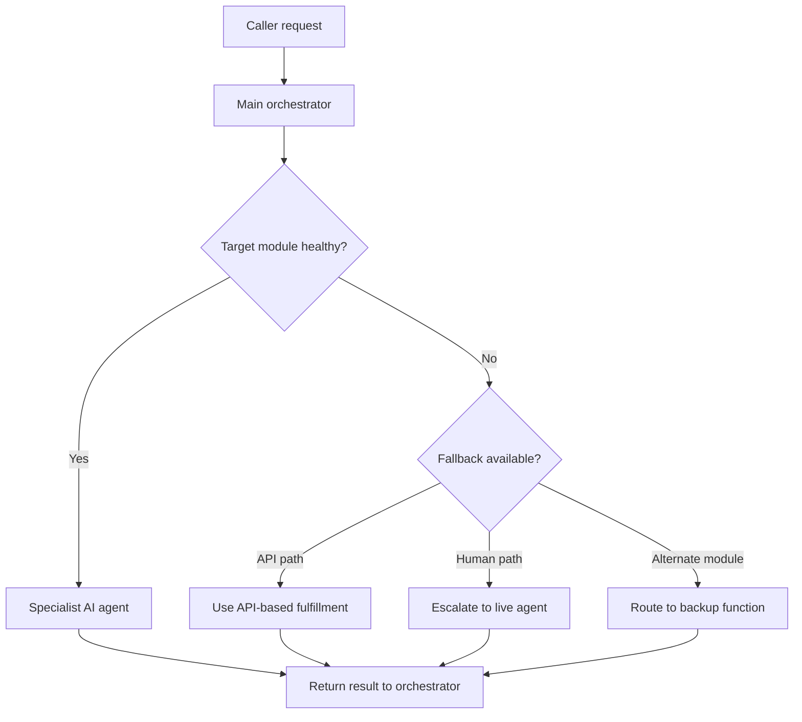
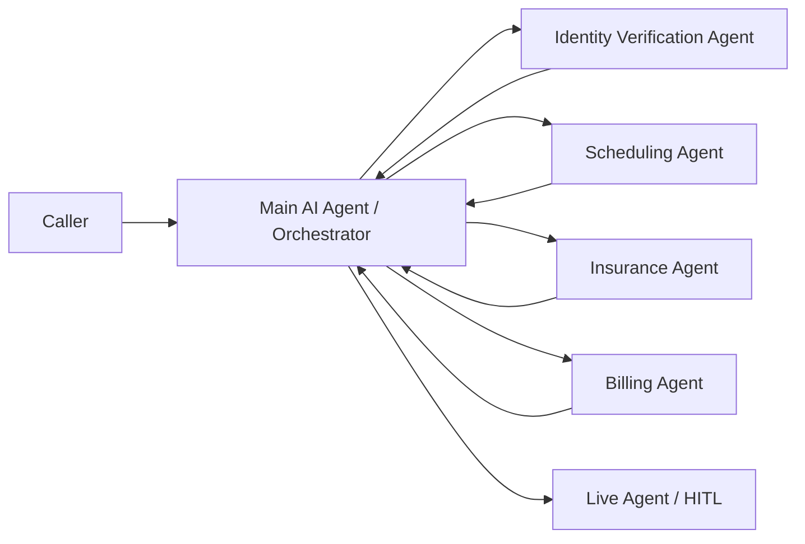

# Multi Agent Strategy

This chapter explains how to break a large customer journey into focused AI agents that can be tested, secured, updated, and escalated independently.

> Image note: The visuals in this chapter are extracted from, or derived from, the PowerPoint's native slide objects. They are not full-slide screenshots.

## What You Are Building

A multi-agent design uses one main orchestrator plus specialist agents. The orchestrator owns the customer journey. Specialist agents own narrow jobs such as identity verification, appointment lookup, insurance validation, billing review, cancellation, rescheduling, or live-agent escalation.

The goal is not to create more bots for the sake of it. The goal is to avoid one all-purpose agent with too many instructions, too many actions, and too much access.

## Why It Matters

The workshop recommendation was clear: keep agents small, modular, and functionally scoped. In healthcare and contact center workflows, a single caller journey may touch several domains:

| Domain | Specialist Agent Responsibility | Human-in-the-Loop Role |
| --- | --- | --- |
| Verification | Match caller identity and required slots | Approve uncertain identity matches |
| Scheduling | Book, cancel, or reschedule appointments | Resolve exceptions or unavailable slots |
| Insurance | Validate policy and coverage data | Review coverage exceptions |
| Billing | Retrieve balances and process approved actions | Authorize disputed or sensitive charges |
| Escalation | Detect routing, sentiment, or risk triggers | Provide empathy and final resolution |

## Advantages From The Workshop

The five advantages you called out in the workshop are the backbone of the multi-agent strategy:

- Workflow specialization.
- Risk mitigation and security.
- Operational resilience.
- Simplified governance.
- Human-in-the-loop.

Each advantage becomes stronger when the agent has a clear starting point, a clear ending point, and a small set of actions.

## Advantage 1: Workflow Specialization

Workflow specialization means breaking a complex customer request into smaller, manageable modules. In the healthcare example from the workshop, one patient call can involve identity verification, appointment booking, cancellation, rescheduling, billing, insurance validation, and escalation. Trying to make one AI agent own all of that creates a large, fragile bot.

The better pattern is to create focused agents with narrow responsibility:

| Specialist Agent | Owns | Should Not Own |
| --- | --- | --- |
| Identity verification | Matching caller identity and collecting required verification slots | Billing logic, appointment routing, insurance decisions |
| Appointment booking | Finding and booking available appointments | Payment disputes or coverage exceptions |
| Appointment cancellation | Validating appointment ID and cancelling the visit | New appointment discovery unless explicitly routed |
| Insurance validation | Checking coverage and returning eligibility status | Final exception approval |
| Billing review | Retrieving balances and preparing approved billing actions | Identity policy or clinical workflow |

The practical guidance from the workshop was to keep each autonomous agent near five business actions. That keeps the instructions smaller, leaves room for consult and transfer actions, and makes state management easier. A specialized agent is easier to test because it has fewer branches and a clearer end state.

**Customer-facing value:** the caller moves through a cleaner journey. The system asks for only the information needed for that module, completes that work, and then returns to the orchestrator or hands off to the right next step.

## Advantage 2: Risk Mitigation And Security

Multi-agent design reduces risk by limiting the blast radius of each agent. A scheduling agent does not need billing permissions. A billing agent does not need broad appointment-management privileges. An insurance validation agent should only receive the minimum data needed to validate coverage.

This supports least privilege:

| Security Concern | Multi-Agent Advantage |
| --- | --- |
| Data leakage | Each agent receives only the data needed for its function |
| Over-permissioned automation | Tools and MCP capabilities are scoped per specialist |
| Audit difficulty | Logs map to a specific agent and action instead of one all-powerful bot |
| Prompt or instruction drift | Smaller instructions reduce conflicting behavior |
| Sensitive workflows | Human approval can be inserted at high-risk boundaries |

In the workshop, the key point was that auditing becomes simpler when an agent has three to five actions instead of a long list of unrelated capabilities. If an issue occurs, the team can identify which module, action, MCP call, or handoff produced the result.

**Customer-facing value:** sensitive information is handled more carefully, and the customer is less likely to be exposed to incorrect or unauthorized automation.

## Advantage 3: Operational Resilience

Operational resilience means one module can fail without bringing down the entire customer journey. In the workshop example, if the billing module is unavailable, scheduling can still continue. If appointment booking is down, cancellation or rescheduling may still work. If one MCP server is unavailable, that specific function can fall back to an API path or human escalation.

Design the orchestrator to check module health and choose a controlled fallback:

Resilience also matters during audits or operational freezes. If a customer does not want automation handling a specific queue for a few days, that module can be disabled or routed to humans while the rest of the automation continues.

**Customer-facing value:** the customer does not hit a dead end just because one backend system, MCP server, queue, or specialist function is unavailable.

## Advantage 4: Simplified Governance

Governance is simpler when each agent owns one clear process. If the insurance process changes, update the insurance validation agent. If appointment cancellation rules change, update the cancellation agent. You do not need to retest every unrelated function inside a large monolithic bot.

This helps with:

| Governance Need | Multi-Agent Benefit |
| --- | --- |
| Change management | Update one module without full journey redeployment |
| Certification | Validate the affected function instead of the entire bot |
| Compliance review | Review a smaller permission and data-access surface |
| Regression testing | Test one start state, one end state, and known fallback paths |
| Ownership | Assign clear owners to scheduling, billing, insurance, and escalation modules |

The workshop guidance was to modularize before the system becomes difficult to maintain. Once one large bot grows past a handful of actions, every change creates more testing, more risk, and more uncertainty.

**Customer-facing value:** the organization can improve workflows faster while keeping production behavior stable.

## Advantage 5: Human-In-The-Loop

Human-in-the-loop is not a failure path. It is part of the architecture. The workshop emphasized that AI can retrieve data quickly and manage repeatable work, but it does not replace human empathy, judgment, or exception handling.

Every specialist agent should have a defined escalation point:

| Module | AI Agent Responsibility | Human Role |
| --- | --- | --- |
| Verification | Match submitted data against records | Approve uncertain identity matches |
| Insurance | Retrieve policy and eligibility details | Review coverage exceptions |
| Billing | Calculate or retrieve billing details | Authorize final charges or disputes |
| Escalation | Detect sentiment or routing risk | Provide empathetic resolution |
| Scheduling | Find available slots and prepare changes | Resolve unavailable, urgent, or special-case requests |

Use human escalation when the intent is low confidence, the customer is frustrated, the action is sensitive, the data match is uncertain, or a backend path fails. The important design point is to provide a warm handoff: pass the customer intent, verification state, collected slots, last successful action, MCP results, risk flags, and correlation IDs.

**Customer-facing value:** the customer gets automation when it is helpful and a person when judgment, empathy, or exception handling matters.

## Recommended Pattern

Use a hub-and-spoke pattern.

The orchestrator should re-evaluate state after every specialist module returns. That gives the flow one reliable place to reset state, choose the next module, or move to a human.

## The Rule of 5

Use the platform action threshold as an architecture signal, not just a limit. The practical recommendation from the workshop was to keep each autonomous AI agent near five business actions.

Reserve the rest of the capacity for transfer, consult, fallback, and human escalation.

| Design Item | Recommendation |
| --- | --- |
| Business actions | Keep near five per specialist agent |
| Transfer and consult | Reserve capacity for agent handoffs |
| Human escalation | Keep a clear escalation route at every endpoint |
| Instructions | Keep concise to reduce context-window pressure |
| Fulfillment payloads | Return only the data the next step needs |

## Design Each Agent Around a Start and End State

Do not start by asking, "How many bots do we need?" Start by asking, "Where does this work naturally begin and end?"

Good boundaries:

| Agent | Start State | End State |
| --- | --- | --- |
| Appointment cancellation | Caller is verified and appointment ID is known | Appointment is cancelled or exception is escalated |
| Appointment booking | Caller is verified and appointment intent is confirmed | Appointment is booked or alternatives are offered |
| Billing review | Caller is verified and billing intent is confirmed | Balance is explained, payment path is offered, or dispute is escalated |
| Insurance validation | Required patient and coverage data are known | Coverage result is returned or human review is requested |

If an agent has no clear endpoint, it is probably too broad.

## Consult vs Transfer

Use consult when the primary agent should remain the owner and only needs help.

Use transfer when another agent, queue, or human should own the next part of the conversation.

| Pattern | Use When | Result |
| --- | --- | --- |
| Consult | The orchestrator needs validation, lookup, or routing readiness | The specialist returns data and the orchestrator keeps control |
| Transfer | The caller has a confirmed intent that belongs to a specialist | Ownership moves to the target agent or human |
| Human-in-the-loop | The request is sensitive, uncertain, emotional, or high risk | A human receives a warm handoff with context |

## Resilience Strategy

A modular design lets one function fail without bringing down the entire journey. If billing is unavailable, scheduling can still work. If booking is down, cancellation or rescheduling can continue. If an audit freezes one queue, that specific function can move to a human route while other functions stay automated.

Build each module with:

- Timeout and retry limits.
- A fallback route to the orchestrator.
- A human escalation path.
- Clear logging of source agent, target agent, reason, latency, and outcome.
- A short context payload, not the whole transcript.

## Implementation Checklist

- Define the orchestrator and its routing rules.
- List the top customer intents by volume and failure rate.
- Split specialist agents by clear start and end state.
- Keep each specialist agent near five business actions.
- Grant each specialist only the tools and data it needs.
- Use MCP for tool, data, and system access.
- Use A2A or native transfer mechanics for agent-to-agent collaboration.
- Add human escalation at every module boundary.
- Log correlation IDs across agent, MCP, and contact center events.
- Measure containment, transfer completion, latency, fallback rate, and repeat-contact rate.

## Field Guidance

Start with the customer journeys that fail most often. Do not try to redesign the entire contact center at once. Move one workflow into the hub-and-spoke model, prove the handoff quality, then expand.

The best first candidates are workflows with high volume, clear state, narrow data needs, and visible pain when transfer context is lost.

## Related Chapters

- [Model Context Protocol](model-context-protocol.md)
- [A2A](a2a.md)

## Sources

- Workshop transcript: `AI Strategic Partner Tech Workshop-20260518 1705-1.vtt`
- Slide deck: `MGB (1).pptx`
