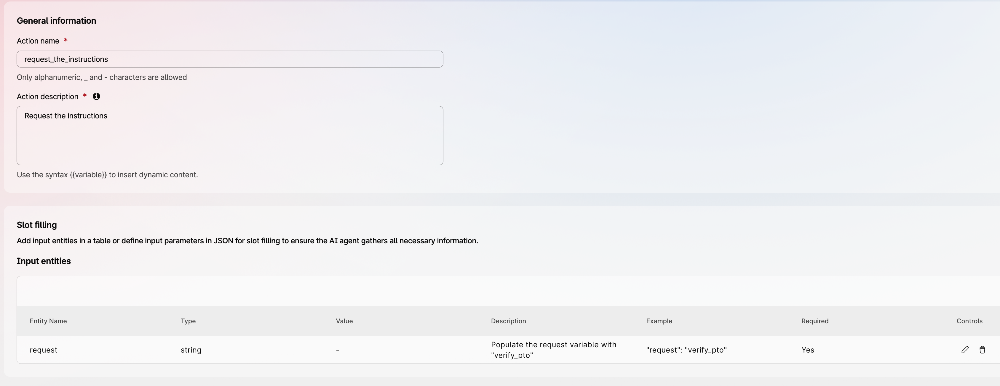
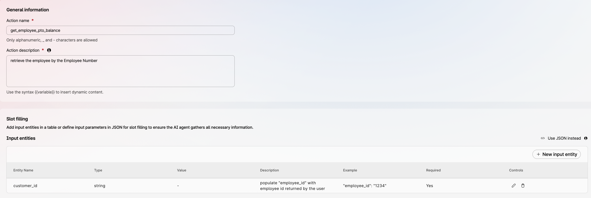

## When Prompts Are Not Enough

A common design mistake in AI agents is assuming that a prompt alone can reliably enforce a step-by-step business procedure.

This becomes a problem when the agent is expected to behave intelligently in conversation while also following a strict troubleshooting path, validation sequence, or policy-driven decision flow.

### Problem Statement

In many customer support and contact center scenarios, the agent must do more than answer questions naturally. It must also follow a sequence of required checks, ask specific questions when certain conditions are met, and avoid skipping important steps.

Examples include:

- troubleshooting flows
- issue triage
- printer or network diagnostics
- access request handling
- policy-based routing or escalation

The challenge is that large language models do not execute business logic in the same way that software does. Even when instructions are written clearly in a prompt or a knowledge base, the model may:

- skip steps
- ask too many questions
- ask questions out of order
- interpret instructions loosely
- fail to branch consistently
- hallucinate values when exact matching is required

This is especially risky when the workflow depends on deterministic behavior.

### Why This Happens
Language models are strong at understanding intent and generating natural responses, but they are less reliable when asked to follow multi-step procedural logic purely from free-form text.

A prompt may describe rules such as:

- if the user has provided an Employee ID, ask what issue they are experiencing
- if the issue is printer-related, ask printer-specific questions
- if the resource is shared, ask whether other users are affected
- if the issue is software-related, ask which application is involved

You might find that writing the above rules with a programming-language style might work better than using human language. 
But flows like the one above implicitly require procedural state: for example, whether `employee_id_check` is true or false, whether a previous step has been completed, and which branch should be executed next. The problem is that an LLM does not natively operate as a deterministic workflow engine with guaranteed state tracking, conditional execution, and control flow. It generates the next response token by token.

However, across the millions of documents seen during training, the model statistically captures different patterns associated with natural language and programming language data.

Human language is not strictly tied to exact wording. Word order may vary, synonyms often preserve the core meaning, and the same concept can be expressed in many different ways. Typos or minor errors are often tolerated without changing the intended meaning. Human language relies heavily on semantics, while allowing broader syntactic variation.

Programming languages, on the other hand, depend heavily on exact syntax. Specific keywords are required, punctuation matters, and a missing comma or bracket may break the entire program. Programming languages require strict syntax and tightly constrained semantics.

For this reason, when procedures are encoded as structured JSON workflow variables, the LLM tends to follow them more precisely than equivalent free-form natural language instructions.

Externalizing workflow logic into a JSON structure helps address both limitations: structured formats strengthen syntactic focus, while state, branching, and execution rules are shifted out of the LLM into an explicit machine-readable layer.


### Recommended Action

Use prompts for conversation, tone, intent recognition, summarization, and general reasoning.

Do not rely on prompts alone to guarantee consistent execution of multi-step procedures, troubleshooting paths, or conditional workflows.

When interactions require mandatory steps, branching logic, state tracking, or repeatable outcomes, place that control logic in an external structured layer, such as a JSON workflow or database-driven flow definition.

In this model, the AI Agent focuses on language understanding and user interaction, while the external workflow layer controls sequence, decisions, and next-step execution.

This separation typically improves reliability, consistency, maintainability, and operational control.

### Best Practice

A good rule of thumb is:

- use the model for interpretation
- use structured data for control

Two implementation models can be considered:

1. Hybrid Control Model  
   Workflow logic is split between prompt instructions and an external JSON/database layer.

2. Fully Externalized Control Model  
   Workflow logic is moved almost entirely into an external JSON/database layer, while the LLM focuses on language understanding, reasoning, and interaction.

#### 1. Hybrid Control Model
Imagine an AI Agent used to triage IT issues. After identifying which resource is affected, the agent must ask additional questions depending on the issue type.

Possible follow-up questions are:
- Site location
- Whether other users are experiencing the same issue
- Which application is involved

These questions do not apply equally to every category. Knowing the location of a printer may be important, while it may be irrelevant for access issues on a web application.

If we describe this behavior only in human language, the AI Agent may behave inconsistently. However, if we convert the logic into variables stored in a database and retrieved as JSON, the structured format increases the syntactic focus of the interaction, making the LLM more attentive to exact fields, conditions, and transitions than it would typically be with plain natural language instructions.
Below is an example of a JSON variable that can be stored in Webex Connect or in an external database:

```
{
  "id": "obj1",
  "category": "Web Application",
  "ask_site": false,
  "check_application": true,
  "check_other_users": false
}

{
  "id": "obj2",
  "category": "Printer",
  "ask_site": true,
  "check_application": false,
  "check_other_users": true
}
```
After identifying the category, the agent retrieves the corresponding configuration.

The following are the instructions for the AI Agent:
```
1. Identify the user issue and use the [category_list] action to map it to a single category.
2. Use the mapped category to call the [selected_category] action and retrieve its configuration.

Then evaluate the following conditions:

- If `check_application` is `true` and no application has been specified, ask which application is involved.
- If `ask_site` is `true` and no site is confirmed, ask for the site and validate it.
- If `check_other_users` is `true` and you do not yet know whether other users are affected, ask the user whether anyone else is experiencing the same issue.
```
In this model, logic is partly encoded in the prompt and partly externalized in the JSON/database layer.
Natural language instructions leave broad room for interpretation.
Structured formats such as JSON reduce that ambiguity by constraining the decision space.
Externalizing workflow logic into machine-readable structures does not make the LLM a true executor, but it significantly improves reliability, consistency, and controllability.
It is also possible to externalize the logic almost entirely, while the LLM still provides language understanding, reasoning, and interaction skills.

#### 2. Fully Externalized Control Model
When applicable, this model is preferred because the workflow logic is entirely moved out of the LLM into an external control layer. The LLM still executes the interaction while preserving its intelligence to communicate naturally with the user, interpret responses, and correctly identify the issue.

We will provide two examples: one based on a decision tree, and the other based on an execution graph that also includes actions. 
The decision tree example is particularly useful because it introduces the concept of nodes and explains the different node types.


##### Decision Tree Example
A decision tree focuses primarily on branching logic and selecting the correct path based on conditions.
For instance, imagine you want to build an AI Agent that greets the user based on the user’s status.

Suppose the required instructions are:

- Ask the user which access type they have.
- If Gold: “Hello, valued user.”
- If Silver: “Have you ever considered upgrading to Gold access?”
- If Standard: “You would gain many more benefits with Silver or Gold access.”

Instead of writing these instructions only in natural language, you can represent them as a structured JSON variable such as:
```
{
  "nodes": [
    {
      "id": "input_access_type",
      "kind": "input",
      "prompt": "Which access type do you have? (Gold, Silver, Standard)",
      "variable": "access_type",
      "next": "branch_access_type"
    },
    {
      "id": "branch_access_type",
      "kind": "branch",
      "condition": "access_type",
      "cases": {
        "Gold": "instruction_gold",
        "Silver": "instruction_silver",
        "Standard": "instruction_standard"
      }
    },
    {
      "id": "instruction_gold",
      "kind": "instruction",
      "message": "Hello, valued user.",
      "next": "terminal_end"
    },
    {
      "id": "instruction_silver",
      "kind": "instruction",
      "message": "Have you ever considered upgrading to Gold access?",
      "next": "terminal_end"
    },
    {
      "id": "instruction_standard",
      "kind": "instruction",
      "message": "You would gain many more benefits with Silver or Gold access.",
      "next": "terminal_end"
    },
    {
      "id": "terminal_end",
      "kind": "terminal",
      "outcome": "complete",
      "message": "Instruction delivered."
    }
  ]
}
```
Each JSON object represents a node in the execution graph, identified by a unique node ID.

The `next` key points to the following node in the workflow.

The `kind` key defines the type of operation being performed, for example:

- instruction
- input
- choice
- branch
- routing_tool
- data_tool
- terminal

In the example above:

- the `input` node collects user input
- the `branch` node performs decision-tree selection based on the access type
- the `instruction` nodes define what the AI Agent should say or do
- the `terminal` node ends the interaction

Additional node types may also be used:

- `choice`: presents multiple selectable options to the user
- `routing_tool`: executes an action whose result immediately determines the next route
- `data_tool`: executes an action that returns variables or data, and may be followed by a `branch` node that evaluates the returned results.

This JSON variable can be stored externally, for example in a database or in Webex Connect, and retrieved through an action call.

For instance, if the variable is stored in Webex Connect, an action such as [request_instructions] can be created to retrieve it.

The AI Agent instructions can then be simplified to:
```
Use the action [request_instructions] to retrieve the workflow instructions, then execute the defined steps to greet the user appropriately.
```


##### Execution Graph Example
An execution graph extends decision-tree logic by adding actions, variable evaluation, state transitions, and workflow orchestration.
For example, imagine an AI Agent that supports internal users with HR-related requests. The agent should handle free-form questions naturally, while ensuring that specific processes—such as PTO balance checks, absence requests, or compensation inquiries—follow mandatory procedures.

Suppose the PTO balance process must strictly follow an approved workflow:

	1	Gather Employee Information: Request the following details from the employee, one at a time:
	   •	First Name
	   •	Last Name
	   •	Employee ID
	2	Database Retrieval: Use the provided Employee ID to access the database and retrieve the employee's first name, last name, and Paid Time Off (PTO) balance.
	3	Identity Verification:
	   •	Match Found: If the first name and last name provided by the employee match the information retrieved from the database, inform the employee that their identity has been verified. Proceed to step 4.
	   •	No Match: If the provided first name and last name do not match the database records, inform the employee that the information provided does not match our records. Terminate the procedure.
	4	Provide PTO Balance: If the identity verification in step 3 was successful, provide the employee with their current PTO balance.

If this procedure must be followed consistently and without deviation, relying only on knowledge-base instructions may not be sufficient.

> **Note:** For the sake of simplicity, this example uses identity verification based on Employee ID, first name, and last name. This is only intended to make the workflow easier to understand. In a production environment, this step would typically be replaced by a more advanced authentication and authorization mechanism.

The workflow logic can instead be externalized into a JSON execution graph stored in Webex Connect or an external database:

```
{
  "_id": {
    "$oid": "69e3883c27296a6fafbd7c80"
  },
  "meta": {
    "title": "Verify Employee PTO Balance",
    "context": "Procedure to verify an employee's identity and provide their PTO balance.",
    "name": "verify_pto"
  },
  "graph": {
    "start": "input_first_name",
    "nodes": [
      {
        "id": "input_first_name",
        "kind": "input",
        "prompt": "Please provide your first name.",
        "variable": "first_name",
        "next": "input_last_name"
      },
      {
        "id": "input_last_name",
        "kind": "input",
        "prompt": "Please provide your last name.",
        "variable": "last_name",
        "next": "input_employee_id"
      },
      {
        "id": "input_employee_id",
        "kind": "input",
        "prompt": "Please provide your Employee ID.",
        "variable": "employee_id",
        "next": "retrieve_employee_data"
      },
      {
        "id": "retrieve_employee_data",
        "kind": "data_tool",
        "action": "get_employee_pto_balance",
        "parameters": [
          "employee_id"
        ],
        "output_variables": [
          "db_first_name",
          "db_last_name",
          "pto_balance"
        ],
        "next": "verify_identity"
      },
      {
        "id": "verify_identity",
        "kind": "branch",
        "condition": "first_name == db_first_name && last_name == db_last_name",
        "cases": {
          "true": "identity_verified",
          "false": "identity_not_verified"
        }
      },
      {
        "id": "identity_verified",
        "kind": "instruction",
        "message": "Your identity has been verified.",
        "next": "provide_pto_balance"
      },
      {
        "id": "provide_pto_balance",
        "kind": "terminal",
        "outcome": "success",
        "message": "Your current PTO balance is: {pto_balance}."
      },
      {
        "id": "identity_not_verified",
        "kind": "terminal",
        "outcome": "failure",
        "message": "The information provided does not match our records. Procedure terminated."
      }
    ]
  }
```

The first three nodes under the `graph` section are `input` nodes, used to collect the user’s information.
The fourth node is a `data_tool` node, used to query the database using the parameter `employee_id`, and to return the output variables `db_first_name`, `db_last_name`, and `pto_balance`.
These returned variables are then compared with the user-provided information in the `verify_identity` node.
The final two `terminal` nodes represent the two possible outcomes: successful identity verification with PTO balance disclosure, or failed verification with procedure termination.

The AI Agent Instructions will be:
```
If an user asks about the PTO balance, use the action [request_the_instructions] to obtain instructions and follow the steps.
```
Then, we need to create two actions.

The first action is called request_the_instructions and is used to retrieve the workflow instructions from the database:



The second action is called `get_employee_pto_balance` and is used to retrieve the employee PTO information from the database:



### When To Use This Pattern

This pattern is a good fit when the agent must:

- follow a troubleshooting sequence
- apply policy-driven branching
- validate exact values from a known list
- avoid skipping mandatory checks
- support repeatable service workflows
- provide consistent outcomes across users

### Additional Recommendation

If the workflow depends on exact values such as site names, issue categories, or approved options, validate them through tool calls or a database lookup instead of relying on the model to infer them from text alone.

This reduces hallucination risk and improves reliability.

### What This Means For Prompt Design

Prompt engineering still matters, but prompts should not carry responsibilities that belong to workflow logic.

A strong prompt should tell the agent:

- what its role is
- when to use a structured flow
- when to call a tool
- when to stop and escalate
- what it must not do

But the decision logic itself should live outside the prompt whenever reliability matters.

### Practical Takeaway

If a process must be followed consistently, do not store that process only as prose in a prompt or knowledge base.

Move the workflow into a structure the system can follow explicitly, such as:

- a decision tree
- a JSON workflow
- a rule-based state graph
- a validated tool-driven sequence

Use the prompt to guide behavior around that structure, not to replace it.

