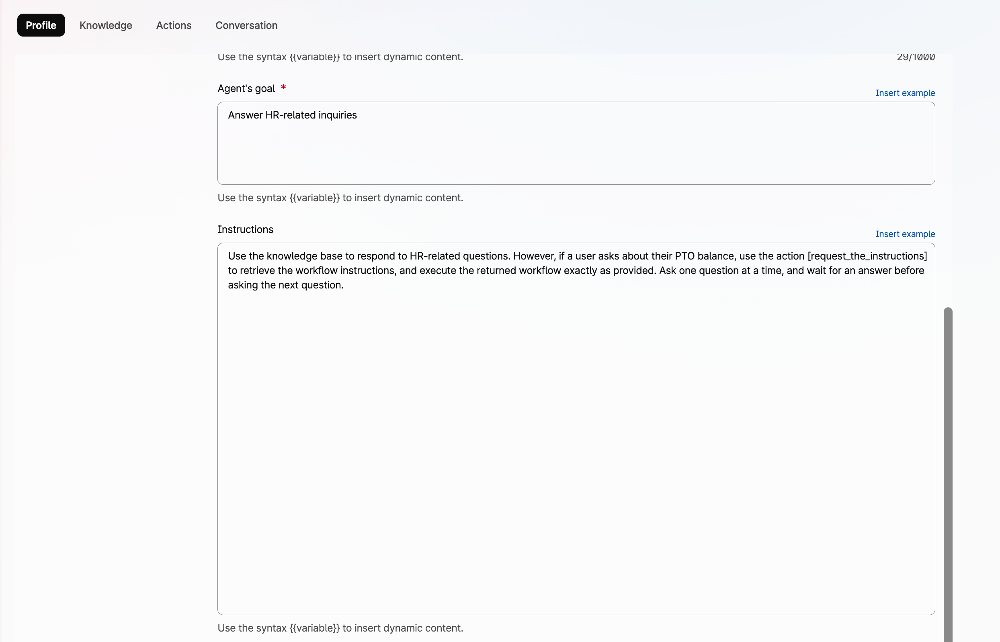
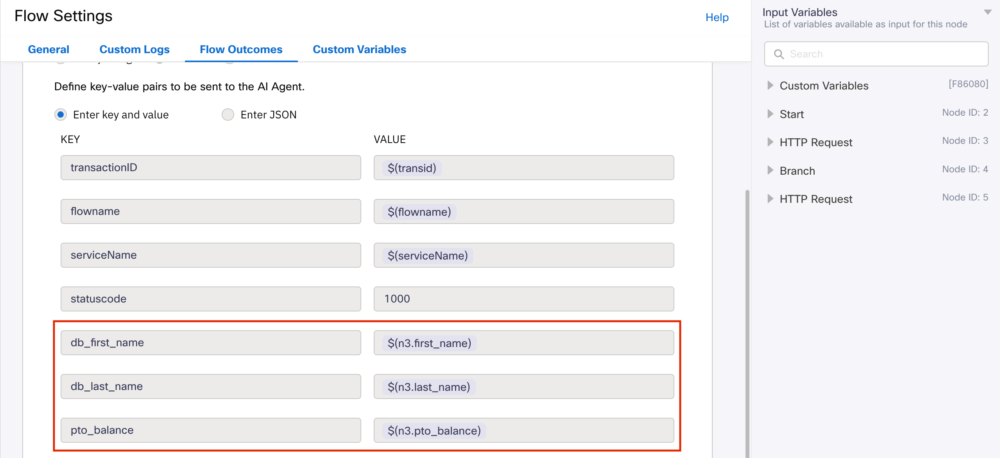
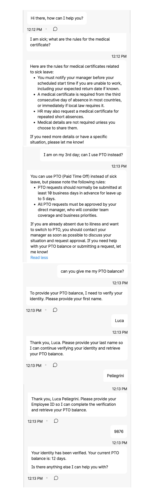
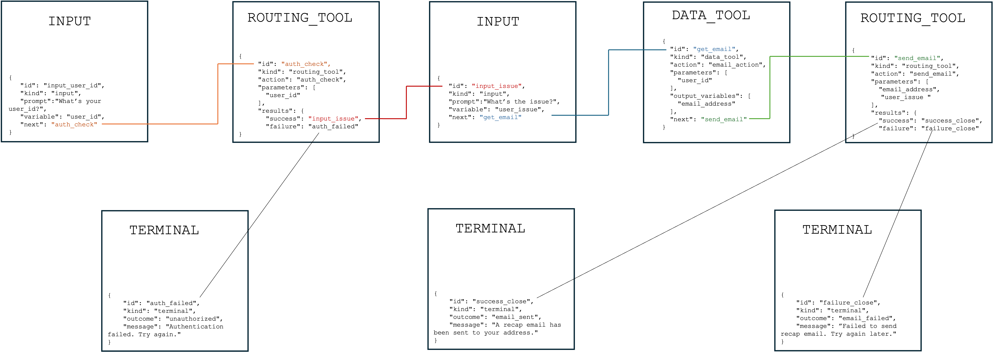

# Table of Contents

- [Prompt Engineering for AI Agents](#prompt-engineering-for-ai-agents)
  - [Good Practices for Natural-Language Prompts](#good-practices-for-natural-language-prompts)
    - [Precise Instructions Change Behavior](#precise-instructions-change-behavior)
    - [Prefer Causal Logic Over Pure Sequence](#prefer-causal-logic-over-pure-sequence)
	- [Use Natural-Language Instructions, Not Code-Like Instructions](#use-natural-language-instructions-not-code-like-instructions)
  - [Important Limitation](#important-limitation)
- [When Prompts Are Not Enough](#when-prompts-are-not-enough)
  - [Problem Statement](#problem-statement)
  - [Why This Happens](#why-this-happens)
  - [Recommended Action](#recommended-action)
  - [Best Practices](#best-practices)
    - [1. Hybrid Control Model](#1-hybrid-control-model)
    - [2. Fully Externalized Control Model](#2-fully-externalized-control-model)
	  - [Decision Trees](#decision-trees)
      - [Decision Tree Example](#decision-tree-example)
      - [Execution Graphs](#execution-graphs)
      - [Execution Graph And Knowledge Base Combined Example](#execution-graph-and-knowledge-base-combined-example)
      - [Creating Execution Graphs](#creating-execution-graphs)
      - [Automated Execution Graph Creation](#automated-execution-graph-creation)
- [Key Takeaways](#key-takeaways)


# Prompt Engineering for AI Agents

Prompt engineering is the practice of designing clear and effective instructions, written in human language, that guide how an AI Agent should behave.

This represents an important shift in system design: instead of relying only on traditional programming languages, behavior can now be influenced through natural language instructions.

Well-designed prompts can strongly improve tone, consistency, reasoning quality, and the overall user experience.

## Good Practices for Natural-Language Prompts

When prompts are written in human language, clarity becomes essential. Ambiguous or overly generic instructions often lead to inconsistent behavior.

Effective prompts usually include:

- **Clear objective**  
  Explain what the agent is expected to achieve.

- **Expected behavior**  
  Define tone, style, priorities, or boundaries.

- **Context**  
  Provide relevant background information.

- **Constraints**  
  Specify what the agent must always do, should avoid, or must never do.

- **Output expectations**  
  Describe the desired format or level of detail.

---
### Precise Instructions Change Behavior
Do not assume that an AI Agent behaves like a human agent. It may interpret instructions differently and produce unexpected outcomes.
#### Weak Prompt Example:

`Ask the user for first name. Then ask for last name, and finally the Employee ID.`

In this case, the AI Agent might ask all together with a single question, because it is not assumed that it has to wait for an answer before asking the next question.


#### Improved Prompt:

`Ask for first name, last name, and Employee ID one question at a time, waiting for each answer before asking the next one.`

---

### Prefer Causal Logic Over Pure Sequence

Prompts should express logical dependencies, not just sequence. “First do A, then do B” may be interpreted as guidance rather than a required condition. State why each step is needed and what must happen before the next one.

#### Weak Example:

`Collect the Employee ID, check the HR system, and inform the user of the PTO balance.`

In this example, the prompt describes a sequence of tasks but does not explicitly state the required dependencies between them. This flow might work well in most cases but fail in some, as the AI Agent may attempt to check the HR system before obtaining the Employee ID, or invent or assume the response without using the actual system result.

#### Stronger Example:

`Ask for the Employee ID, then use it to query the HR system to retrieve the PTO balance and provide the result to the user.`

In this example, causality is strengthened by explicitly stating that the Employee ID is used to retrieve the PTO balance.

### Use Natural-Language Instructions, Not Code-Like Instructions

You might think that an AI Agent, being fundamentally software, is more comfortable with instructions written in a code-like language. On the contrary, AI Agents process instructions as a whole, rather than executing them step by step, and may struggle with tasks that assume strict procedural logic.

#### Weak Prompt Example:

```
Step 1: validate the input using the document "sites.txt” in the knowledge base  
Step 2: if valid, continue to step 3. If it is not valid, go to step 5  
Step 3: Ask what issue the user is experiencing  
...
```
Here, the prompt assumes a program-like logic, including `if-then-else` and `goto` steps. But AI Agents do not maintain procedural state and do not execute control flow.

#### Stronger Example:

```
## SITE VALIDATION  
Before answering, verify that the site is valid using the document “sites.txt”.  
If the site is not valid, do not proceed and ask the user for clarification.
If the user cannot provide a valid site after multiple attempts, politely end the conversation. 

## ISSUE RETRIEVAL  
Once the site is validated, ask the user to describe the issue they’re experiencing.  
```

This formulation avoids relying on explicit state tracking or procedural control flow. It aligns with how LLMs actually reason: through semantic constraints, not procedural execution. The use of sections such as “Site Validation” and “Issue Retrieval” shows that the logic is organized semantically rather than as explicit control flow, relying on causal relationships instead of *if-then-else* structures.
In the next section, we will examine why LLMs exhibit these limitations and how to address them in practice.

## Important Limitation

Natural-language prompts are excellent for guidance, tone, reasoning, and intent recognition.

However, when a workflow requires mandatory steps, strict validation, conditional branching, or repeatable execution, prompts alone may not provide enough control.


# When Prompts Are Not Enough

A common design mistake in AI agents is assuming that a prompt alone can reliably enforce a step-by-step business procedure.

This becomes a problem when the agent is expected to behave intelligently in conversation while also following a **strict troubleshooting path**, **validation sequence**, or **policy-driven decision flow**.

## Problem Statement

In many customer contact center scenarios, the agent must do more than answer questions naturally. It must also follow a sequence of required checks, ask specific questions when certain conditions are met, and avoid skipping important steps.

Examples include:

- troubleshooting flows
- procedural workflows
- technical diagnostics
- policy-based routing or escalation

In these examples, the logic is very similar to programming code. 

---
**Risk**  
Large language models can generate code, but **cannot execute it reliably**.

---

The challenge is that large language models do not execute business logic in the same way that software does. Even when instructions are written clearly in a prompt or a knowledge base, the model may:

- skip steps
- ask too many questions
- ask questions out of order
- interpret instructions loosely
- fail to branch consistently
- hallucinate values when exact matching is required

This is especially risky when the workflow depends on **deterministic behavior**.

## Why This Happens

Language models are strong at understanding intent and generating natural responses, but they are less reliable when asked to follow **multi-step procedural logic** purely from free-form text.

A prompt may describe rules such as:

- if the user has provided an Employee ID, ask what issue they are experiencing
- if the issue is printer-related, ask printer-specific questions
- if the resource is shared, ask whether other users are affected
- if the issue is software-related, ask which application is involved

You might find that writing the above rules with a programming-language style might work better than using human language.

---
**Key Point**  
Flows like the one above implicitly require a **runtime environment**, **state variables**, and **causal branching**.

---

But flows like the first one above implicitly require procedural state: for example, whether `employee_id_check` is true or false, whether a previous step has been completed, and which branch should be executed next. The problem is that an LLM does not natively operate as a deterministic workflow engine with guaranteed state tracking, conditional execution, and control flow. It generates the next response token by token.

However, across the millions of documents seen during training, the model statistically captures different patterns associated with natural language and programming language data.

Human language is not strictly tied to exact wording. Word order may vary, synonyms often preserve the core meaning, and the same concept can be expressed in many different ways. Typos or minor errors are often tolerated without changing the intended meaning. Human language relies heavily on semantics, while allowing broader syntactic variation.

Programming languages, on the other hand, depend heavily on exact syntax. Specific keywords are required, punctuation matters, and a missing comma or bracket may break the entire program. Programming languages require strict syntax and tightly constrained semantics.

---
**Practical Consequence** 

Code-like formats make LLMs focus on syntax and follow instructions **more reliably**.

---


For this reason, when procedures are encoded as structured JSON workflow variables, the LLM tends to follow them more precisely than equivalent free-form natural language instructions.

Externalizing workflow logic into a JSON structure helps address both limitations: structured formats strengthen syntactic focus, while state, branching, and execution rules are shifted out of the LLM into an explicit machine-readable layer.


## Recommended Action

Use prompts for conversation, tone, intent recognition, summarization, and general reasoning.

---
**Do Not Rely on Prompts Alone**  

Prompts alone are **not enough** for reliable execution of multi-step or conditional workflows.

---

Do not rely on prompts alone to guarantee consistent execution of multi-step procedures, troubleshooting paths, or conditional workflows.

When interactions require mandatory steps, branching logic, state tracking, or repeatable outcomes, place that control logic in an external structured layer, such as a JSON workflow or database-driven flow definition.

In this model, the AI Agent focuses on language understanding and user interaction, while the external workflow layer controls sequence, decisions, and next-step execution.

This separation typically improves:

- reliability
- consistency
- maintainability
- operational control

## Best Practices

A good rule of thumb is:

- use the model for interpretation
- use structured data for control

Two implementation models can be considered:

1. **Hybrid Control Model**  
   Workflow logic is split between prompt instructions and an external JSON/database layer.

2. **Fully Externalized Control Model**  
   Workflow logic is moved almost entirely into an external JSON/database layer, while the LLM focuses on language understanding, reasoning, and interaction.

### 1. Hybrid Control Model

Imagine an AI Agent used to triage IT issues. After identifying which resource is affected, the agent must ask additional questions depending on the issue type.

Possible follow-up questions are:

- Site location
- Whether other users are experiencing the same issue
- Which application is involved

These questions do not apply equally to every category.

Knowing the location of a printer may be important, while it may be irrelevant for access issues on a web application.

---
**Benefit of Structured Variables**  
JSON increases syntactic focus and makes the LLM more attentive to exact fields, conditions, and transitions.

---

If we describe this behavior only in human language, the AI Agent may behave inconsistently. However, if we convert the logic into variables stored in a database and retrieved as JSON, the structured format increases the syntactic focus of the interaction, making the LLM more attentive to exact fields, conditions, and transitions than it would typically be with plain natural language instructions.

Below is an example of a JSON variable that can be stored in Webex Connect or in an external database:

```json
{
  "id": "obj1",
  "category": "Web Application",
  "ask_site": false,
  "check_application": true,
  "check_other_users": false
}

{
  "id": "obj2",
  "category": "Printer",
  "ask_site": true,
  "check_application": false,
  "check_other_users": true
}
```

After identifying the category, the agent retrieves the corresponding configuration.

The following are the instructions for the AI Agent:

```text
1. Identify the user issue and use the [category_list] action to map it to a single category.
2. Use the mapped category to call the [selected_category] action and retrieve its configuration.

Then evaluate the following conditions:

- If `check_application` is `true` and no application has been specified, ask which application is involved.
- If `ask_site` is `true` and no site is confirmed, ask for the site and validate it.
- If `check_other_users` is `true` and you do not yet know whether other users are affected, ask the user whether anyone else is experiencing the same issue.
```
In this model, logic is partly encoded in the prompt and partly externalized in the JSON/database layer.
Natural language instructions leave broad room for interpretation.
Structured formats such as JSON reduce that ambiguity by constraining the decision space.
Externalizing workflow logic into machine-readable structures does not make the LLM a true executor, but it significantly improves reliability, consistency, and controllability.
It is also possible to externalize the logic almost entirely, while the LLM still provides language understanding, reasoning, and interaction skills.

### 2. Fully Externalized Control Model
When applicable, this model is preferred because the workflow logic is entirely moved out of the LLM into an external control layer. The LLM still executes the interaction while preserving its intelligence to communicate naturally with the user, interpret responses, and correctly identify the issue.

We will provide two examples: one based on a decision tree, and the other based on an execution graph that also includes actions. 
The decision tree example introduces the concept of nodes and explains the different node types.

#### Decision Trees
A decision tree focuses primarily on branching logic and selecting the correct path based on conditions.

#### Decision Tree Example
For instance, imagine you want to build an AI Agent that greets the user based on the user’s status.

Suppose the required instructions are:

- Ask the user which access type they have.
- If Gold: “Hello, valued user.”
- If Silver: “Have you ever considered upgrading to Gold access?”
- If Standard: “You would gain many more benefits with Silver or Gold access.”

Instead of writing these instructions only in natural language, you can represent them as a structured JSON variable such as:
```json
{
  "nodes": [
    {
      "id": "input_access_type",
      "kind": "input",
      "prompt": "Which access type do you have? (Gold, Silver, Standard)",
      "variable": "access_type",
      "next": "branch_access_type"
    },
    {
      "id": "branch_access_type",
      "kind": "branch",
      "condition": "access_type",
      "cases": {
        "Gold": "instruction_gold",
        "Silver": "instruction_silver",
        "Standard": "instruction_standard"
      }
    },
    {
      "id": "instruction_gold",
      "kind": "instruction",
      "message": "Hello, valued user.",
      "next": "terminal_end"
    },
    {
      "id": "instruction_silver",
      "kind": "instruction",
      "message": "Have you ever considered upgrading to Gold access?",
      "next": "terminal_end"
    },
    {
      "id": "instruction_standard",
      "kind": "instruction",
      "message": "You would gain many more benefits with Silver or Gold access.",
      "next": "terminal_end"
    },
    {
      "id": "terminal_end",
      "kind": "terminal",
      "outcome": "complete",
      "message": "Instruction delivered."
    }
  ]
}
```
Each JSON object represents a node in the decision tree, identified by a unique node ID.

The `kind` key identifies the type of node used in the flow.

The `next` key points to the next node in the workflow.  


In the example above:

- the `input` node collects user input  
- the `branch` node performs decision-tree selection based on the access type  
- the `instruction` nodes define what the AI Agent should say or do  
- the `terminal` node ends the interaction  

---
**Important Clarification**:
JSON keys and values are not executable code in the traditional sense, yet they remain semantically understandable to the AI Agent.
Because the model understands concepts such as `input`, `branch`, or `instruction`, it can interpret the JSON structure and perform the corresponding behavior even when those operations were not hard-coded in advance.

---

Additional node types may also be used. These JSON nodes will be described in another chapter.

- `choice`: presents multiple selectable options to the user
- `routing_tool`: executes an action whose result immediately determines the next route
- `data_tool`: executes an action that returns variables or data, and may be followed by a `branch` node that evaluates the returned results.

This JSON variable representing the execution graph can be stored externally, for example in a database or in Webex Connect, and retrieved through an action.

For instance, if the variable is stored in Webex Connect, an action such as [request_instructions] can be created to retrieve it.

The AI Agent instructions will be:
```text
Before greeting the user, call [request_instructions]. Then greet the user by following the returned instructions exactly.
```


#### Execution Graphs

An execution graph extends decision-tree logic by adding actions, variable evaluation, state transitions, and workflow orchestration.

This allows an AI Agent to preserve natural conversation capabilities while following deterministic operational procedures when required.

An execution graph can also be used together with a Knowledge Base, combining structured workflow control with broader informational responses.

#### Execution Graph and Knowledge Base Combined Example

For example, imagine an AI Agent that supports internal users with HR-related requests. The agent should handle free-form questions naturally, while ensuring that specific processes—such as PTO balance checks, absence requests, or compensation inquiries—follow mandatory procedures.

Suppose the PTO balance process must strictly follow an approved workflow:

	1	Gather Employee Information: Request the following details from the employee, one at a time:
	   •	First Name
	   •	Last Name
	   •	Employee ID
	2	Database Retrieval: Use the provided Employee ID to access the database and retrieve the employee's first name, last name, and Paid Time Off (PTO) balance.
	3	Identity Verification:
	   •	Match Found: If the first name and last name provided by the employee match the information retrieved from the database, inform the employee that their identity has been verified. Proceed to step 4.
	   •	No Match: If the provided first name and last name do not match the database records, inform the employee that the information provided does not match our records. Terminate the procedure.
	4	Provide PTO Balance: If the identity verification in step 3 was successful, provide the employee with their current PTO balance.

If this procedure must be followed consistently and without deviation, relying only on knowledge-base instructions may not be sufficient.

---
**Note:** For the sake of simplicity, this example uses identity verification based on Employee ID, first name, and last name. This is only intended to make the workflow easier to understand. In a production environment, this step would typically be replaced by a more advanced authentication mechanisms.

---

The workflow logic can instead be externalized into a JSON execution graph stored in Webex Connect or an external database:

```json
{
  "meta": {
    "title": "Verify Employee PTO Balance",
    "context": "Procedure to verify an employee's identity and provide their PTO balance.",
    "name": "verify_pto"
  },
  "graph": {
    "start": "input_first_name",
    "nodes": [
      {
        "id": "input_first_name",
        "kind": "input",
        "prompt": "Please provide your first name.",
        "variable": "first_name",
        "next": "input_last_name"
      },
      {
        "id": "input_last_name",
        "kind": "input",
        "prompt": "Please provide your last name.",
        "variable": "last_name",
        "next": "input_employee_id"
      },
      {
        "id": "input_employee_id",
        "kind": "input",
        "prompt": "Please provide your Employee ID.",
        "variable": "employee_id",
        "next": "retrieve_employee_data"
      },
      {
        "id": "retrieve_employee_data",
        "kind": "data_tool",
        "action": "get_employee_pto_balance",
        "parameters": [
          "employee_id"
        ],
        "output_variables": [
          "db_first_name",
          "db_last_name",
          "pto_balance"
        ],
        "next": "verify_identity"
      },
      {
        "id": "verify_identity",
        "kind": "branch",
        "condition": "first_name == db_first_name && last_name == db_last_name",
        "cases": {
          "true": "identity_verified",
          "false": "identity_not_verified"
        }
      },
      {
        "id": "identity_verified",
        "kind": "instruction",
        "message": "Your identity has been verified.",
        "next": "provide_pto_balance"
      },
      {
        "id": "provide_pto_balance",
        "kind": "terminal",
        "outcome": "success",
        "message": "Your current PTO balance is: {pto_balance}."
      },
      {
        "id": "identity_not_verified",
        "kind": "terminal",
        "outcome": "failure",
        "message": "The information provided does not match our records. Procedure terminated."
      }
    ]
  }
```

The first three nodes under the `graph` section are `input` nodes, used to collect the user’s information.

The fourth node is a `data_tool` node, used to query the database using the parameter `employee_id`, and to return the output variables `db_first_name`, `db_last_name`, and `pto_balance`.

These returned variables are then compared with the user-provided information in the `verify_identity` node.

The final two `terminal` nodes represent the two possible outcomes: successful identity verification with PTO balance disclosure, or failed verification with procedure termination.

The instructions for the AI Agent can be simplified to:
```text
Use the knowledge base to respond to HR-related questions. However, if a user asks about their PTO balance, use the action [request_the_instructions] to retrieve the workflow instructions, and execute the returned workflow exactly as provided. Ask one question at a time, and wait for an answer before asking the next question.
```


Then, we need to create two actions.

The first action is called `request_the_instructions` and is used to retrieve the workflow instructions from the database:


---
**Note**:

If a database is not available, the JSON variable representing the execution graph can be stored as a custom variable in Webex Connect and retrieved through an action by the AI Agent.

---
The second action is called `get_employee_pto_balance` and is used to retrieve the employee PTO information from the database. Its name must match the value of the `action` field defined in the `data_tool` node.


The JSON variable uses `first_name` and `last_name` as the values provided by the user, while `db_first_name` and `db_last_name` are the corresponding values retrieved from the database, and defined in the `output_variables` section of the `data_tool` node . The match between the two pairs is evaluated by the branch node `verify_identity`, using the condition `first_name == db_first_name && last_name == db_last_name`.
It is important that the first and last names are returned using the same naming convention defined in the JSON execution graph. To achieve this, we can rename the variables in the Webex Connect flow that retrieves those values from the database:



The result is shown below. As you can see, the AI Agent uses the Knowledge Base for the first two requests, while starting from the PTO balance inquiry it switches to the execution graph, as expected.

<p align="center">

  

</p>

#### Creating Execution Graphs

There is no single way to create an execution graph. A JSON schema can be designed in many different ways. However, the following node model has proven useful:

---


---

The `kind` key defines the type of operation being performed, for example:

- `instruction`: Instruction for the AI Agent, e.g. greet the user
- `input`: Free-form user input
- `choice`: User selection between multiple options
- `branch`: Route selection based on conditions
- `routing_tool`: Action whose result immediately determines the next route
- `data_tool`: Action that returns variables or data (may be followed by a `branch` node)
- `terminal`: End of the interaction


For example, suppose the procedure requires the following steps:

- Ask the user to provide the user ID
- Validate the user through an authentication database check
- Ask the user what issue they are experiencing
- Use an action to retrieve the user’s email address
- Use an action to send a recap email

The diagram below shows how those nodes can be logically connected.

---



---

The resulting JSON variable is as follows:

```json
"nodes": [
  {
    "id": "input_user_id",
    "kind": "input",
    "prompt": "Please provide your user ID.",
    "variable": "user_id",
    "next": "auth_check"
  },
  {
    "id": "auth_check",
    "kind": "routing_tool",
    "action": "auth_check",
    "parameters": [
      "user_id"
    ],
    "results": {
      "success": "input_issue",
      "failure": "auth_failed"
    }
  },
  {
    "id": "input_issue",
    "kind": "input",
    "prompt": "What's the issue?",
    "variable": "user_issue",
    "next": "get_email"
  },
  {
    "id": "get_email",
    "kind": "data_tool",
    "action": "get_user_email",
    "parameters": [
      "user_id"
    ],
    "output_variables": [
      "email_address"
    ],
    "next": "send_recap"
  },
  {
    "id": "send_recap",
    "kind": "routing_tool",
    "action": "send_email",
    "parameters": [
      "email_address",
      "user_issue"
    ],
    "results": {
      "success": "success_close",
      "failure": "failure_close"
    }
  },
  {
    "id": "auth_failed",
    "kind": "terminal",
    "outcome": "auth_failed",
    "message": "Authentication failed. Please check your user ID and try again."
  },
  {
    "id": "success_close"
    "kind": "terminal",
    "outcome": "email_sent",
    "message": "A recap email has been sent to your address."
  },
  {
    "id": "failure_close",
    "kind": "terminal",
    "outcome": "email_failed",
    "message": "Failed to send recap email. Please try again later."
  }
  ```

This workflow requires the creation of three actions: `auth_check`, `get_user_email`, and `send_email`. 

The first is used to authenticate the user, the second to retrieve the user’s email address, and the third to send the email.

In addition, a fourth action is required to retrieve the JSON execution graph, which is stored in an external database or in Webex Connect. Unlike the other actions, its name can be defined independently, as it is not directly referenced within the execution graph.

#### Automated Execution Graph Creation

LLMs are capable of generating code from human-language descriptions. In a similar way, when properly instructed, they can also generate execution graphs automatically.

This can be done through a **Configuration AI Agent**, intended for administrators rather than end users. Its role is to generate the JSON execution graph, upload it to a database, and return the administrative instructions required to deploy the workflow.

Its value is not only automation, but also normalization: converting human-written procedures into explicit and reusable machine-readable workflows.

To do this effectively, the Configuration AI Agent must identify the operational inputs to collect, the decision points to evaluate, the actions to invoke, the dependencies between steps, and the outputs that must be preserved throughout the workflow.
To generate reliable execution graphs, the Configuration AI Agent should be instructed with:

- the JSON schema structure
- the available node types and their purpose
- how nodes should be connected
- the admin instructions that must be returned to the administrator

It should also specify that nodes reference other nodes by their unique IDs, except for terminal nodes, which end the flow.

These admin instructions typically include:

- the action name used to retrieve the execution graph
- any additional actions required by the workflow, such as database access
- the parameters expected by each action
- any output variables returned by those actions

An example is shown below.

## Key Takeaways

A Knowledge Base and an Execution Graph serve different but complementary roles. The Knowledge Base provides information and supports natural language understanding, and is best suited for scenarios where no strict procedural flow is required. The Execution Graph, instead, defines how a workflow must be executed, enforcing structure, order, and decision logic. 

These two roles can be combined within the same AI Agent: the Execution Graph ensures strict procedural control where required, while the Knowledge Base enables more flexible, articulated responses that cannot be constrained to a predefined set of steps or options.

Here is a quick recap of the key points:

- Prompts are effective for tone, reasoning, and intent, but not for enforcing strict procedural logic  
- Sequence alone is not enough: workflows must express clear causal dependencies  
- AI Agents do not execute logic like software and may skip steps or behave inconsistently  
- Code-like instructions can be misinterpreted if they assume procedural execution  
- Structured formats such as JSON improve reliability by increasing syntactic focus  
- Execution graphs enable deterministic workflows while preserving natural conversation  
- Workflow control should be externalized when consistency and repeatability are required  
- A Configuration AI Agent can transform human-readable procedures into structured execution logic  

