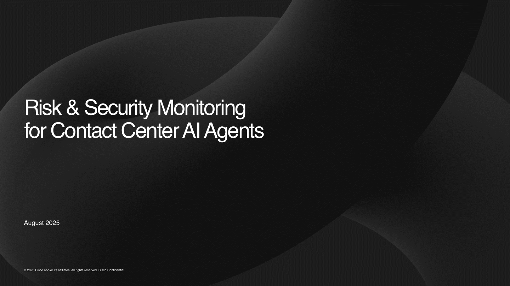
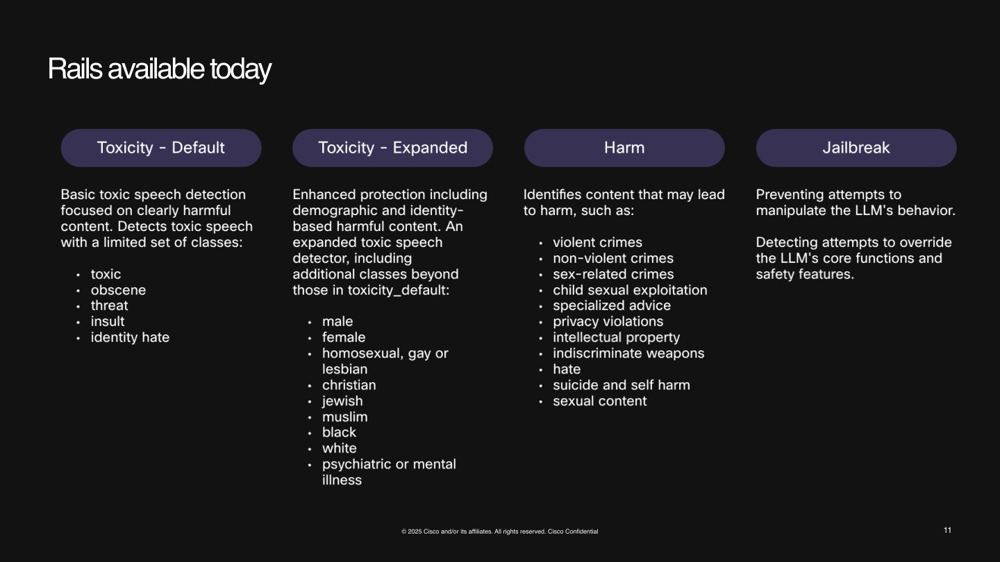
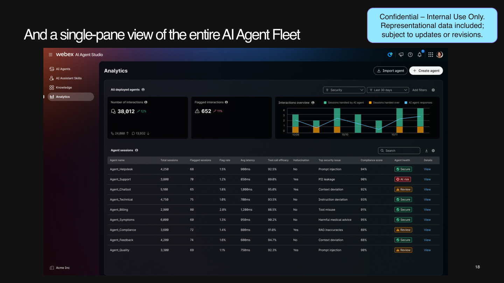
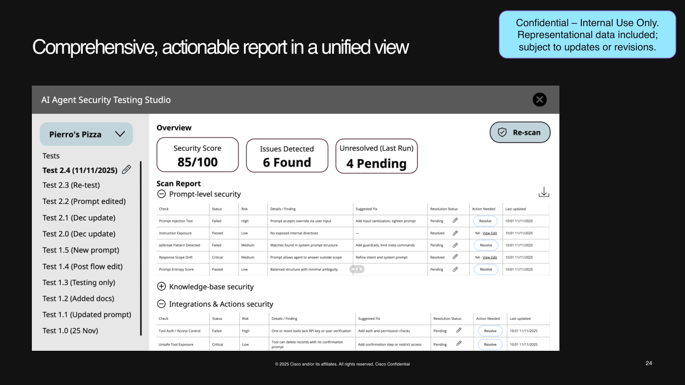
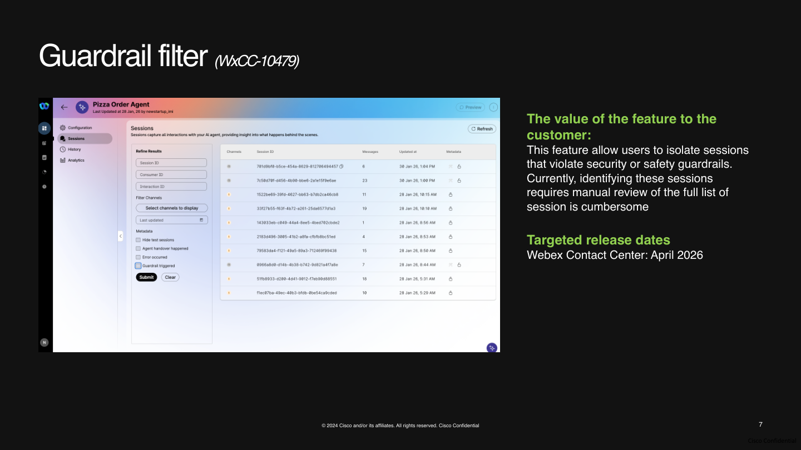
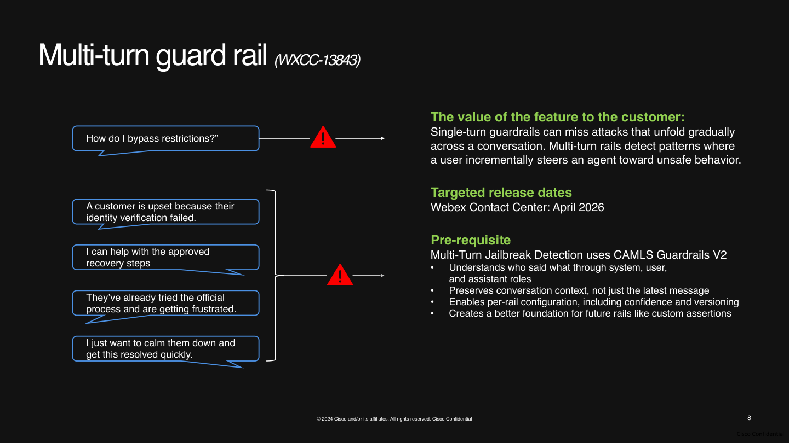
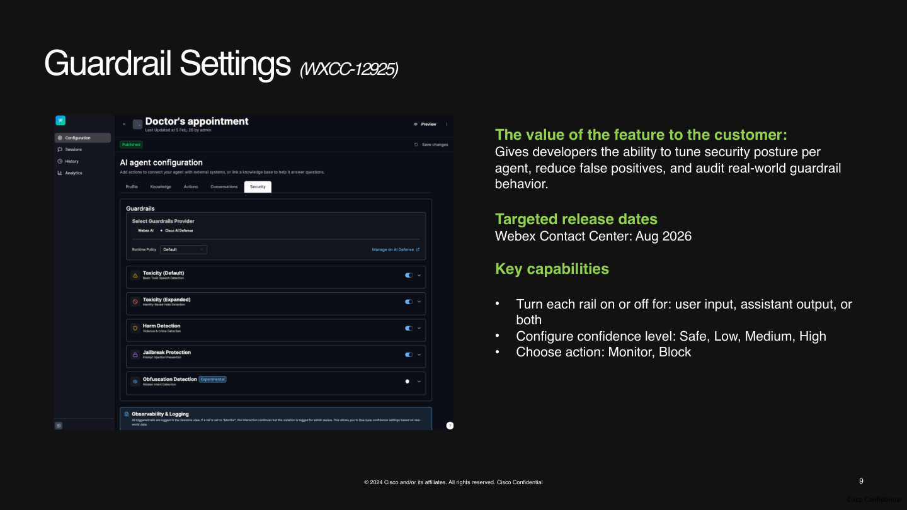
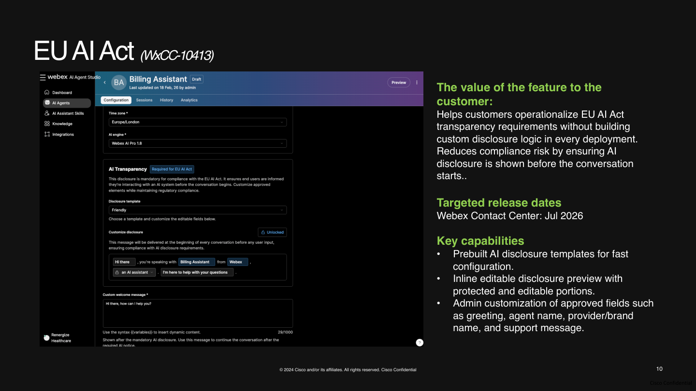
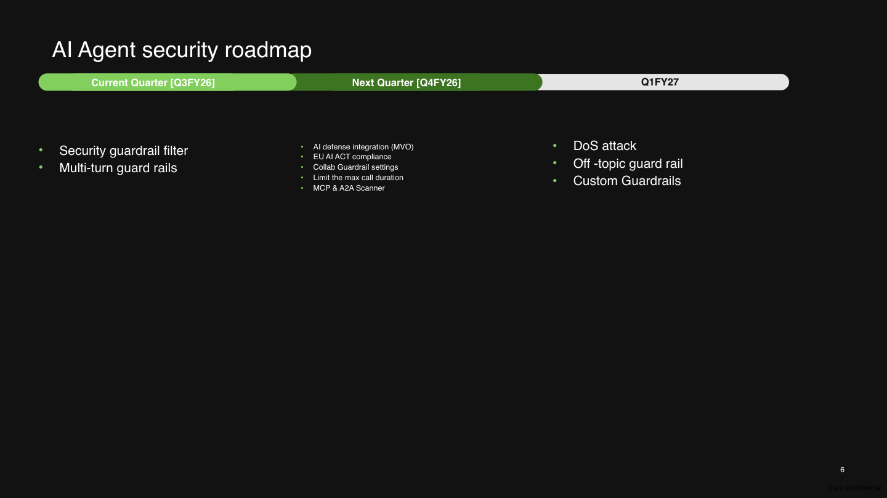

# Security

Security for AI agents in Webex Contact Center is not just about blocking unsafe prompts. It is about protecting the full interaction lifecycle: inputs, prompts, knowledge, actions, outputs, logs, and operational controls.

A secure AI agent should not only respond safely. It should also be designed, tested, monitored, and governed in a way that reduces risk before, during, and after deployment.

## Why Security Matters

AI agents introduce a broader attack surface than traditional scripted bots or fixed workflows. In a contact center environment, that risk can include:

- prompt injection
- jailbreak attempts
- harmful or toxic outputs
- data leakage
- unsafe tool usage
- weak tenant isolation
- poor observability
- compliance failures
- multi-turn manipulation across a conversation

This means AI agent security must be treated as an end-to-end discipline rather than a single moderation step.

## Current Security Foundations

The current Webex AI Agent security posture is built around several core layers.

### Responsible AI Governance

AI-powered features are reviewed through Cisco's Responsible AI framework and AI Impact Assessment process. This is intended to ensure that trust, safety, and risk evaluation are part of the product lifecycle.

### Tenant Isolation and Ephemeral LLM Calls

The current architecture emphasizes tenant isolation and short-lived LLM interactions.

Key design ideas include:

- customer data is isolated in Cisco cloud environments
- LLM requests are scoped using tenant identifiers
- LLM calls are ephemeral rather than long-lived sessions
- conversation artifacts are retained on the Cisco side, not persisted at the LLM provider layer

This reduces the chance of cross-tenant bleedover and limits data persistence outside Cisco-managed systems.

### Runtime Guardrails Available Today

Current runtime protections include standard guardrails that screen inputs and outputs for common classes of unsafe behavior.

Examples shown in the current security material include:

- `Toxicity - Default`
- `Toxicity - Expanded`
- `Harm`
- `Jailbreak`

These are intended to catch clearly unsafe content and attempts to manipulate or override the model.

### Runtime Visibility and Analytics

A major part of security is visibility. The current product direction includes richer analytics so admins can review:

- flagged interactions
- agent health
- top security issues
- compliance-related indicators
- session-level details

### Design-Time Security Testing

One of the strongest security directions is shifting validation earlier in the lifecycle.

Instead of discovering problems only after launch, design-time testing is intended to help catch issues such as:

- prompt injection
- prompt manipulation
- harmful content generation
- privacy and data security issues
- integration and action risks

## What Problems Still Exist

The roadmap discussion makes it clear that some important gaps still exist today.

### Single-Turn Guardrails Are Limited

A major weakness of single-turn protection is that many attacks unfold gradually across a conversation. Each individual turn may appear harmless, while the overall conversation drifts into unsafe territory.

### Monitoring Is Still Maturing

Customers want easier ways to identify, filter, and investigate sessions that triggered security rails. Current views help, but broader fleet-level observability is still evolving.

### Compliance Controls Need Stronger Enforcement

Customers need stronger support for mandatory AI disclosure and non-interruptible compliance messaging, especially for regulated and voice-based use cases.

### Security Tuning Is Still Limited

Teams want more control over:

- which rails are active
- how sensitive each rail should be
- whether a rail should monitor or block
- whether it should apply to input, output, or both

## What Is Planned Next

The upcoming roadmap is focused on closing those gaps.

### Security Guardrail Filter

A planned filter will help teams isolate sessions where a security or safety rail was triggered instead of manually reviewing the full session list.

### Multi-Turn Guardrails

This is one of the most important planned improvements.

The core problem being addressed is simple: attacks often happen over multiple turns, not one prompt. Multi-turn rails are meant to detect gradual steering, role confusion, and attempts to move an agent toward unsafe behavior over time.

Expected value includes:

- preserving conversation context
- understanding who said what
- detecting gradual unsafe steering
- providing a stronger foundation for future advanced rails

### Guardrail Settings

A planned security settings experience is intended to give teams more direct control over posture at the agent level.

Expected controls include:

- enabling or disabling a specific rail
- applying a rail to input, output, or both
- selecting confidence or severity levels
- choosing whether to `Monitor` or `Block`

This helps reduce false positives while still preserving protection.

### EU AI Act Support

The roadmap also includes built-in support for AI disclosure and transparency requirements.

This is intended to help teams implement compliant disclosure behavior without custom logic for every deployment.

### AI Defense Integration

The long-term direction is not to rely only on baseline built-in guardrails. The product strategy points toward pairing standard protections with Cisco AI Defense as an optional advanced layer.

Current framing suggests:

- Webex AI or Collab AI remains the default
- AI Defense is offered as an advanced security option
- packaging and pricing are still evolving
- deeper platform integration is part of the longer-term plan

### Additional Roadmap Items

Other roadmap themes include:

- custom guardrails
- off-topic guardrails
- DoS-related protections
- maximum call-duration controls
- MCP and A2A scanning

## Security Best Practices

Even with strong platform controls, customers still own important parts of the final security posture.

### 1. Minimize Exposure

Only expose the data, tools, and actions the agent truly needs.

- reduce unnecessary context
- avoid broad tool permissions
- keep knowledge sources scoped and curated

### 2. Separate Conversation From Control

Prompts should define behavior, but critical workflow control should not rely on natural-language instructions alone.

Use structured logic, validated tools, or workflow controls when reliability matters.

### 3. Validate Exact Values Outside the Model

For exact matches such as site names, policy values, IDs, or approved actions, use a trusted system of record or tool call instead of asking the model to infer from text.

### 4. Assume Adversarial Inputs Will Happen

Design for:

- jailbreak attempts
- role confusion
- indirect prompt injection through retrieved content
- harmful or manipulative user behavior
- gradual multi-turn steering

### 5. Test Before Deploying

Do not wait for live traffic to reveal weaknesses.

Before deployment, test for:

- prompt injection
- unsafe tool invocation
- policy violations
- hallucinated outputs
- escalation failures
- disclosure or compliance gaps

### 6. Monitor After Deploying

Security is not complete at launch.

Review:

- flagged sessions
- recurring attack patterns
- false positives
- model drift or output quality issues
- escalation and containment behavior

### 7. Keep Human Escalation Available

A secure system should know when not to continue autonomously.

Use escalation when:

- the request is ambiguous
- the user is frustrated
- policy restrictions apply
- the model is uncertain
- the action is high risk

## Recommended Operating Model

A practical way to think about Webex Contact Center AI agent security is:

- use built-in platform guardrails as a baseline
- keep prompts, tools, and knowledge narrow
- test aggressively before deployment
- monitor continuously after deployment
- plan for stronger controls as roadmap features mature

## Practical Takeaway

The most important lesson is this:

A secure AI agent is not created by one guardrail, one prompt, or one moderation check. It is created by combining safe architecture, constrained actions, design-time testing, runtime monitoring, and clear governance.

For Webex Contact Center AI agents, the current platform provides a strong starting point. The next wave of product improvements is focused on making that security posture more observable, more tunable, and better suited for real production risk.

